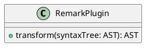

# GROWI v6.0.x へのアップグレード

v6.0 では、アプリケーションフレームワークおよび Markdown レンダリング部分に抜本的な変更が加えられました。
また、複数の仕様変更や廃止された機能があります。


::: warning
v5.x 以降から v6.x へのアップグレードでは基本的に安定動作するはずですが、上記の通り利用者への影響が大きいので、アップグレード前後では変更点について十分に周知をしてください。
:::


## 目次

[[toc]]


## v5.x 系へのダウングレードについて

v5.x 系へのダウングレードで注意すべきことは特にありません。


## [ベータ版] プラグイン機能

- 未対応の機能
  - 冗長化対応
  - main ブランチ以外の指定
  - GitHub 以外の URL の指定
  - ワンクリックアップグレードボタン


## [仕様変更] CDN 利用について

v5.x までは、公式コンテナイメージとして CDN を多用する default 版と、極力 CDN に依存しない nocdn 版を並行リリースしていました。

v6.x 以降はこれを一本化し、極力 CDN の利用を控えた旧 nocdn 版相当の 1 バージョンのみのリリースとしました。

::: warning
v6.0.0 リリース時点では nocdn 化は完全ではなく、一部リソースの取得に CDN を利用していますが、公式コンテナイメージの方向性としては今後極力 CDN への依存を排していく予定です。
:::


## [仕様変更] Draw.io (Diagrams.net) 記法

図表を描くための記法が変更されました。

### :no_entry_sign: Before

~~~ drawio
::: drawio
3Zhdb5swFIZ/TS4XYRswuUzSr0mtVqmtejkZOASvgJHtfO3Xz+YjgdJqiaa1SbnBvD7G9vv4IJsRmeeba8nK9E7EkI2wE29G5GKEMfa9wNyssq0VhFyvVhaSx422Fx74b2hEp1GXPAbVC9RCZJqXfTESRQGR7mlMSrHuhyUi6/dasgUMhIeIZUP1mcc6rdUA071+A3yRtj0jf1LX5KwNbmaiUhaLdUcilyMyl0LoupRv5pBZ91pf6nZX79TuBiah0G80eFIgf4S/rCfYyVhowFRBI+xFIi9FYZthr3WvVaqYGxZy2+xRsugFpCndPN7dmtu0LJtuMxZBaswE2Te4HR7ezXA3cqW3ravGi9IW883CrpsxWyt3nIuQ24BZwrNsLjIhq2CSJOBHkdGVluIFOjUxnYSOY2pWIDU30G7tPO+F4pqLwsSEQmuRmwCmynp1JHwDZoizerS2HWzeNRR1JnENIgcttyakafANuQ3aZnG7Ph37vk8d6pAgoBO3rl131k3TIO0smVZjjZGLXUd7mKbQ2Ng+dvD+M+6n7xatUqDVgXTJ8XQVGZLFlJqEeYtsUl2fRRb7Y+QEJCCIBhQ5ExL0OBPHOReyqsre6VKnRjM+Vu4dxtg9nnEkFgXXYgh6ThFBV6cHmgRj10XUo9jByA1c90vk8/TeJvQ107Bm2wNpe8fTZiX/uWg6GRD3psSZeadH/C+p7RNvTAhxzaedUuoFwbkgf34w4i3Lw5gdSNw/nnhWvf9nsiyimtWBH/TCjPSzgCP/FXH3SwC/YJqFTMGBsOnxsONtwXIRh0PK1q/Z5PRymzgni3qwfW86X7FsCS113KcSLeXKWnNhd7hQxFN7nNlnk1GuuO2yqo+ZSqtg9BYXPwogTHYuQzw49Lzy2AxELGUEnc28OXgxuQA93AF2SEjIzB5j1X/7EdYNfJqcuU/uB/nUnpfP1ijvo4xC52SUNzTK/yij8DkZ5Q+Nov/HKPO4/2lT1XX+fZHLPw==
:::
~~~

### :white_check_mark: After

~~~ drawio
``` drawio
3Zhdb5swFIZ/TS4XYRswuUzSr0mtVqmtejkZOASvgJHtfO3Xz+YjgdJqiaa1SbnBvD7G9vv4IJsRmeeba8nK9E7EkI2wE29G5GKEMfa9wNyssq0VhFyvVhaSx422Fx74b2hEp1GXPAbVC9RCZJqXfTESRQGR7mlMSrHuhyUi6/dasgUMhIeIZUP1mcc6rdUA071+A3yRtj0jf1LX5KwNbmaiUhaLdUcilyMyl0LoupRv5pBZ91pf6nZX79TuBiah0G80eFIgf4S/rCfYyVhowFRBI+xFIi9FYZthr3WvVaqYGxZy2+xRsugFpCndPN7dmtu0LJtuMxZBaswE2Te4HR7ezXA3cqW3ravGi9IW883CrpsxWyt3nIuQ24BZwrNsLjIhq2CSJOBHkdGVluIFOjUxnYSOY2pWIDU30G7tPO+F4pqLwsSEQmuRmwCmynp1JHwDZoizerS2HWzeNRR1JnENIgcttyakafANuQ3aZnG7Ph37vk8d6pAgoBO3rl131k3TIO0smVZjjZGLXUd7mKbQ2Ng+dvD+M+6n7xatUqDVgXTJ8XQVGZLFlJqEeYtsUl2fRRb7Y+QEJCCIBhQ5ExL0OBPHOReyqsre6VKnRjM+Vu4dxtg9nnEkFgXXYgh6ThFBV6cHmgRj10XUo9jByA1c90vk8/TeJvQ107Bm2wNpe8fTZiX/uWg6GRD3psSZeadH/C+p7RNvTAhxzaedUuoFwbkgf34w4i3Lw5gdSNw/nnhWvf9nsiyimtWBH/TCjPSzgCP/FXH3SwC/YJqFTMGBsOnxsONtwXIRh0PK1q/Z5PRymzgni3qwfW86X7FsCS113KcSLeXKWnNhd7hQxFN7nNlnk1GuuO2yqo+ZSqtg9BYXPwogTHYuQzw49Lzy2AxELGUEnc28OXgxuQA93AF2SEjIzB5j1X/7EdYNfJqcuU/uB/nUnpfP1ijvo4xC52SUNzTK/yij8DkZ5Q+Nov/HKPO4/2lT1XX+fZHLPw==
```
~~~

::: tip
以前の記法を使って保存されたページの内容は、GROWI 本体をアップグレードしても自動では変更されません。  
マークダウン文書を一括で新しい記法に書き換えるためのディスカッションを確認してください。  
<https://github.com/weseek/growi/discussions/7180>
:::

## [仕様変更] PlantUML 記法

図表を描くための記法が変更されました。

### :no_entry_sign: Before

~~~ plantuml
@startuml
class RemarkPlugin {
    + transform(syntaxTree: AST): AST
}
@enduml
~~~

### :white_check_mark: After

~~~ plantuml
``` plantuml
class RemarkPlugin {
    + transform(syntaxTree: AST): AST
}
```
~~~

or

~~~ plantuml

~~~

::: tip
以前の記法を使って保存されたページの内容は、GROWI 本体をアップグレードしても自動では変更されません。  
マークダウン文書を一括で新しい記法に書き換えるためのディスカッションを確認してください。  
<https://github.com/weseek/growi/discussions/7180>
:::

## [仕様変更] CSV, TSV によるテーブル描画記法

### :no_entry_sign: Before

~~~
::: tsv
Content Cell  Content Cell
Content Cell  Content Cell
:::
~~~

### :white_check_mark: After

~~~
``` tsv
Content Cell  Content Cell
Content Cell  Content Cell
```
~~~


## [仕様変更] 数式描画ライブラリ

数式描画のためのライブラリが、[MathJax](https://www.mathjax.org/) から [KaTeX](https://katex.org/) に変更されました。

::: warning
以前の記法を使って保存されたページの内容は、GROWI 本体をアップグレードしても自動では変更されません。  
また、一括で KaTeX 記法に書き換えるための手法を提供する予定はありませんのでご注意ください。
:::


## [廃止を伴う仕様変更・未実装] XSS(Cross Site Scripting)対策設定

管理画面のマークダウン設定から設定可能だった「XSS(Cross Site Scripting)対策設定」の設定値が変更になりました。

- 過去の設定は引き継がれず、v6.x 以降を起動した際にデフォルトで ON 状態かつに「おすすめ設定」が選択された状態にセットされます
- 「全てのタグを削除」モードは廃止されました
- 許可されるタグ属性の記述が JSON 形式になりました
- カスタムホワイトリスト機能は未実装です
  - 近い将来実装される予定です
  - ほとんどの場合、「おすすめ設定」で最適なセキュリティが確保されます


## [廃止を伴う仕様変更] カスタム HTML Header

- 利用者の環境保護のため、head タグに自由に文字列・タグを挿入できる「カスタム HTML Header」は廃止されました
- noscript に自由に文字列・タグを挿入できる「カスタム Noscript」が新規追加されました

::: tip
link タグを入れたい場合は以下のようなカスタムスクリプトを記述してください

```javascript
var link = document.createElement('link');
link.id = 'mylink';
link.rel = 'stylesheet';
link.href = 'https://example.com/mystyles.css';
document.head.appendChild(link);
```

:::

## [廃止] GROWI 独自記法のページリンク

v5.x 以前に存在していた以下の独自記法は廃止されました。

`[/Sandbox/Math]`

::: tip
代わりに、以下の記法のどれかを利用してください。

- `[[/Sandbox/Math]]`
- `[[Label>/Sandbox/Math]]`
- `[Label](/Sandbox/Math)`
:::

::: tip
以前の記法を使って保存されたページの内容は、GROWI 本体をアップグレードしても自動では変更されません。  
マークダウン文書を一括で新しい記法に書き換えるためのディスカッションを確認してください。  
<https://github.com/weseek/growi/discussions/7180>
:::

## [廃止] 管理画面表示時の全文検索窓

`/admin` 配下ページでは Navbar の全文検索窓が非表示になりました。


## [未実装] ページドラフト一覧

`/me/drafts` から

## [未実装] プレゼンテーション機能

`/me/drafts`


##

| Before | | After |
|:--:|:--:|:--:|
|| ⇒ ||


## アップグレード前にチェックすべきこと

- [x]
