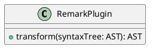

# GROWI v6.0.x へのアップグレード

v6.0 では、アプリケーションフレームワークおよび Markdown レンダリング部分に抜本的な変更が加えられました。
また、複数の仕様変更や廃止された機能があります。


::: warning
v5.x 以降から v6.x へのアップグレードでは基本的に安定動作するはずですが、上記の通り利用者への影響が大きいので、アップグレード前後では変更点について十分に周知をしてください。
:::


## 目次

[[toc]]


## v5.x 系へのダウングレードについて

v5.x 系へのダウングレードで注意すべきことは特にありません。


## [仕様変更] Draw.io (Diagrams.net) 記法

図表を描くための記法が変更されました。

### Before

~~~ drawio
::: drawio
3Zhdb5swFIZ/TS4XYRswuUzSr0mtVqmtejkZOASvgJHtfO3Xz+YjgdJqiaa1SbnBvD7G9vv4IJsRmeeba8nK9E7EkI2wE29G5GKEMfa9wNyssq0VhFyvVhaSx422Fx74b2hEp1GXPAbVC9RCZJqXfTESRQGR7mlMSrHuhyUi6/dasgUMhIeIZUP1mcc6rdUA071+A3yRtj0jf1LX5KwNbmaiUhaLdUcilyMyl0LoupRv5pBZ91pf6nZX79TuBiah0G80eFIgf4S/rCfYyVhowFRBI+xFIi9FYZthr3WvVaqYGxZy2+xRsugFpCndPN7dmtu0LJtuMxZBaswE2Te4HR7ezXA3cqW3ravGi9IW883CrpsxWyt3nIuQ24BZwrNsLjIhq2CSJOBHkdGVluIFOjUxnYSOY2pWIDU30G7tPO+F4pqLwsSEQmuRmwCmynp1JHwDZoizerS2HWzeNRR1JnENIgcttyakafANuQ3aZnG7Ph37vk8d6pAgoBO3rl131k3TIO0smVZjjZGLXUd7mKbQ2Ng+dvD+M+6n7xatUqDVgXTJ8XQVGZLFlJqEeYtsUl2fRRb7Y+QEJCCIBhQ5ExL0OBPHOReyqsre6VKnRjM+Vu4dxtg9nnEkFgXXYgh6ThFBV6cHmgRj10XUo9jByA1c90vk8/TeJvQ107Bm2wNpe8fTZiX/uWg6GRD3psSZeadH/C+p7RNvTAhxzaedUuoFwbkgf34w4i3Lw5gdSNw/nnhWvf9nsiyimtWBH/TCjPSzgCP/FXH3SwC/YJqFTMGBsOnxsONtwXIRh0PK1q/Z5PRymzgni3qwfW86X7FsCS113KcSLeXKWnNhd7hQxFN7nNlnk1GuuO2yqo+ZSqtg9BYXPwogTHYuQzw49Lzy2AxELGUEnc28OXgxuQA93AF2SEjIzB5j1X/7EdYNfJqcuU/uB/nUnpfP1ijvo4xC52SUNzTK/yij8DkZ5Q+Nov/HKPO4/2lT1XX+fZHLPw==
:::
~~~

### After

~~~ drawio
``` drawio
3Zhdb5swFIZ/TS4XYRswuUzSr0mtVqmtejkZOASvgJHtfO3Xz+YjgdJqiaa1SbnBvD7G9vv4IJsRmeeba8nK9E7EkI2wE29G5GKEMfa9wNyssq0VhFyvVhaSx422Fx74b2hEp1GXPAbVC9RCZJqXfTESRQGR7mlMSrHuhyUi6/dasgUMhIeIZUP1mcc6rdUA071+A3yRtj0jf1LX5KwNbmaiUhaLdUcilyMyl0LoupRv5pBZ91pf6nZX79TuBiah0G80eFIgf4S/rCfYyVhowFRBI+xFIi9FYZthr3WvVaqYGxZy2+xRsugFpCndPN7dmtu0LJtuMxZBaswE2Te4HR7ezXA3cqW3ravGi9IW883CrpsxWyt3nIuQ24BZwrNsLjIhq2CSJOBHkdGVluIFOjUxnYSOY2pWIDU30G7tPO+F4pqLwsSEQmuRmwCmynp1JHwDZoizerS2HWzeNRR1JnENIgcttyakafANuQ3aZnG7Ph37vk8d6pAgoBO3rl131k3TIO0smVZjjZGLXUd7mKbQ2Ng+dvD+M+6n7xatUqDVgXTJ8XQVGZLFlJqEeYtsUl2fRRb7Y+QEJCCIBhQ5ExL0OBPHOReyqsre6VKnRjM+Vu4dxtg9nnEkFgXXYgh6ThFBV6cHmgRj10XUo9jByA1c90vk8/TeJvQ107Bm2wNpe8fTZiX/uWg6GRD3psSZeadH/C+p7RNvTAhxzaedUuoFwbkgf34w4i3Lw5gdSNw/nnhWvf9nsiyimtWBH/TCjPSzgCP/FXH3SwC/YJqFTMGBsOnxsONtwXIRh0PK1q/Z5PRymzgni3qwfW86X7FsCS113KcSLeXKWnNhd7hQxFN7nNlnk1GuuO2yqo+ZSqtg9BYXPwogTHYuQzw49Lzy2AxELGUEnc28OXgxuQA93AF2SEjIzB5j1X/7EdYNfJqcuU/uB/nUnpfP1ijvo4xC52SUNzTK/yij8DkZ5Q+Nov/HKPO4/2lT1XX+fZHLPw==
```
~~~

::: tip
以前の記法を使って保存されたページの内容は、GROWI 本体をアップグレードしても自動では変更されません。  
マークダウン文書を一括で新しい記法に書き換えるためのディスカッションを確認してください。  
<https://github.com/weseek/growi/discussions/7180>
:::

## [仕様変更] PlantUML 記法

図表を描くための記法が変更されました。

### Before

~~~ plantuml
@startuml
class RemarkPlugin {
    + transform(syntaxTree: AST): AST
}
@enduml
~~~

### After

~~~ plantuml
``` plantuml
class RemarkPlugin {
    + transform(syntaxTree: AST): AST
}
```
~~~

or

~~~ plantuml

~~~

::: tip
以前の記法を使って保存されたページの内容は、GROWI 本体をアップグレードしても自動では変更されません。  
マークダウン文書を一括で新しい記法に書き換えるためのディスカッションを確認してください。  
<https://github.com/weseek/growi/discussions/7180>
:::

## [仕様変更] CSV, TSV によるテーブル描画記法

### Before

~~~
::: tsv
Content Cell  Content Cell
Content Cell  Content Cell
:::
~~~

### After

~~~
``` tsv
Content Cell  Content Cell
Content Cell  Content Cell
```
~~~


## [仕様変更] 数式描画ライブラリ

[MathJax](https://www.mathjax.org/)

to

[KaTeX](https://katex.org/)


## [仕様変更] XSS(Cross Site Scripting)対策設定

- 過去の設定は引き継がれない
- デフォルトで ON
  - recommended 設定で各種 issue が close される
- attr の記述が JSON になった


## [廃止を伴う仕様変更] カスタム HTML Header

- head に入る カスタム HTML Header は廃止
- noscript に入れられる カスタム HTML が新規追加
- link タグを入れたい場合は以下のようなカスタムスクリプトを書く

    ```javascript
    var link = document.createElement('link');
    link.id = 'mylink';
    link.rel = 'stylesheet';
    link.href = 'https://example.com/mystyles.css';
    document.head.appendChild(link);
    ```

## [廃止] GROWI 独自記法のページリンク

`[/Sandbox/Math]`


## [廃止] ページドラフト一覧

`/me/drafts`

## [廃止] 管理画面表示時の全文検索窓

`/admin` 配下ページでは Navbar の全文検索窓を非表示に


##

| Before | | After |
|:--:|:--:|:--:|
|| ⇒ ||


## アップグレード前にチェックすべきこと

- [x]
