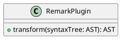

# GROWI v6.0.x へのアップグレード

v6.0 では、

::: danger
:::


## 目次

[[toc]]


## [仕様変更] PlantUML 記法

### Before

~~~ plantuml
@startuml
class RemarkPlugin {
    + transform(syntaxTree: AST): AST
}
@enduml
~~~

### After

~~~ plantuml
``` plantuml
class RemarkPlugin {
    + transform(syntaxTree: AST): AST
}
```
~~~

or

~~~ plantuml

~~~


## [仕様変更] CSV, TSV によるテーブル描画記法

### Before

~~~
::: tsv
Content Cell  Content Cell
Content Cell  Content Cell
:::
~~~

### After

~~~
``` tsv
Content Cell  Content Cell
Content Cell  Content Cell
```
~~~


## [仕様変更] 数式描画ライブラリ

[MathJax](https://www.mathjax.org/)

to

[KaTeX](https://katex.org/)


##


| Before | | After |
|:--:|:--:|:--:|
|| ⇒ ||


## アップグレード前にチェックすべきこと

- [x]
