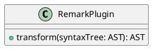

# GROWI v6.0.x へのアップグレード

v6.0 では、アプリケーションフレームワークおよび Markdown レンダリング部分に抜本的な変更が加えられました。
また、複数の仕様変更や廃止された機能があります。


::: warning
v5.x 以降から v6.x へのアップグレードでは基本的に安定動作するはずですが、利用者への影響は少なくありません。アップグレード前後では変更点について十分に周知をしてください。
:::


## 目次

[[toc]]


## 管理者向け

### v5.x 系へのダウングレードについて

v5.x 系へのダウングレードで注意すべきことは特にありません。


### [ベータ版] プラグイン機能

新しいプラグイン機能が追加されました。  
[公式サイト](https://growi.org/plugins)では対応しているプラグイン一覧を確認できます。

2023.01 現在、未実装の機能があります。

- 冗長化対応
  - GROWI 本体は[冗長化に対応しています](../admin-cookbook/loadbalance.html)が、プラグインは未対応です
- main ブランチ以外の指定
- GitHub 以外の URL の指定
- ワンクリックアップグレードボタン

### [仕様変更] CDN 利用について

v5.x までは、公式コンテナイメージとして CDN を多用する default 版と、極力 CDN に依存しない nocdn 版を並行リリースしていました。

v6.x 以降はこれを一本化し、極力 CDN の利用を控えた旧 nocdn 版相当の 1 バージョンのみのリリースとしました。

::: warning
v6.0.0 リリース時点では nocdn 化は完全でなく、一部リソースの取得に CDN を利用していますが、公式コンテナイメージの方向性としては今後極力 CDN への依存を排していく予定です。
:::

### [仕様変更・未実装] 管理画面でのテーマプレビュー

v5.x までは管理画面のカスタム設定ページからテーマの変更をその場でプレビュー可能でしたが、v6 では未実装です。  
またテーマ反映にはページリロードが必要です。

### [仕様変更・未実装] コードハイライトライブラリの変更とテーマの適用

コードハイライトのためのライブラリが、[highlight.js](https://highlightjs.org/) から [Prism](https://prismjs.com/) に変更されました。

それに伴い、管理画面のカスタマイズ設定ページからコードハイライトのテーマを選択できる機能は一時的に利用不可になっています。今後 highlight.js のテーマは選択できなくなり、代わりに Prism のテーマを選択できる機能が実装される予定です。


### [廃止を伴う仕様変更・未実装] XSS(Cross Site Scripting)対策設定

管理画面のマークダウン設定から設定可能だった「XSS(Cross Site Scripting)対策設定」の設定値が変更になりました。

- 過去の設定は引き継がれず、v6.x 以降を起動した際にデフォルトで ON 状態かつ「おすすめ設定」が選択された状態にセットされます
- 「全てのタグを削除」モードは廃止されました
- 許可されるタグ属性の記述が JSON 形式になりました


### [廃止を伴う仕様変更] カスタム HTML Header

- 利用者の環境保護のため、head タグに自由に文字列・タグを挿入できる「カスタム HTML Header」は廃止されました
- noscript に自由に文字列・タグを挿入できる「カスタム Noscript」が新規追加されました

::: tip
link タグを入れたい場合は以下のようなカスタムスクリプトを記述してください。

```javascript
var link = document.createElement('link');
link.id = 'mylink';
link.rel = 'stylesheet';
link.href = 'https://example.com/mystyles.css';
document.head.appendChild(link);
```

:::

### [廃止] Twitter OAuth 2 認証機構

Twitter を使った認証機構は廃止されました。


<!-- textlint-disable weseek/max-kanji-continuous-len -->
### [廃止] 管理画面表示時の全文検索窓
<!-- textlint-enable weseek/max-kanji-continuous-len -->

`/admin` 配下ページでは Navbar の全文検索窓が非表示になりました。


## 利用者向け

### [ベータ版] 編集画面でのテンプレート適用機能

編集画面のテンプレートアイコン () をクリックすることで、編集中のページに定型文を適用できるようになりました。

::: warning
既存の[ページテンプレート機能](../../guide/features/template.html)と名前が似ているため、将来的に名前が変更になる可能性があります。
:::


### [仕様変更] Draw.io (Diagrams.net) 記法

図表を描くための記法が変更されました。

#### :no_entry_sign: Before

~~~ drawio
::: drawio
3Zhdb5swFIZ/TS4XYRswuUzSr0mtVqmtejkZOASvgJHtfO3Xz+YjgdJqiaa1SbnBvD7G9vv4IJsRmeeba8nK9E7EkI2wE29G5GKEMfa9wNyssq0VhFyvVhaSx422Fx74b2hEp1GXPAbVC9RCZJqXfTESRQGR7mlMSrHuhyUi6/dasgUMhIeIZUP1mcc6rdUA071+A3yRtj0jf1LX5KwNbmaiUhaLdUcilyMyl0LoupRv5pBZ91pf6nZX79TuBiah0G80eFIgf4S/rCfYyVhowFRBI+xFIi9FYZthr3WvVaqYGxZy2+xRsugFpCndPN7dmtu0LJtuMxZBaswE2Te4HR7ezXA3cqW3ravGi9IW883CrpsxWyt3nIuQ24BZwrNsLjIhq2CSJOBHkdGVluIFOjUxnYSOY2pWIDU30G7tPO+F4pqLwsSEQmuRmwCmynp1JHwDZoizerS2HWzeNRR1JnENIgcttyakafANuQ3aZnG7Ph37vk8d6pAgoBO3rl131k3TIO0smVZjjZGLXUd7mKbQ2Ng+dvD+M+6n7xatUqDVgXTJ8XQVGZLFlJqEeYtsUl2fRRb7Y+QEJCCIBhQ5ExL0OBPHOReyqsre6VKnRjM+Vu4dxtg9nnEkFgXXYgh6ThFBV6cHmgRj10XUo9jByA1c90vk8/TeJvQ107Bm2wNpe8fTZiX/uWg6GRD3psSZeadH/C+p7RNvTAhxzaedUuoFwbkgf34w4i3Lw5gdSNw/nnhWvf9nsiyimtWBH/TCjPSzgCP/FXH3SwC/YJqFTMGBsOnxsONtwXIRh0PK1q/Z5PRymzgni3qwfW86X7FsCS113KcSLeXKWnNhd7hQxFN7nNlnk1GuuO2yqo+ZSqtg9BYXPwogTHYuQzw49Lzy2AxELGUEnc28OXgxuQA93AF2SEjIzB5j1X/7EdYNfJqcuU/uB/nUnpfP1ijvo4xC52SUNzTK/yij8DkZ5Q+Nov/HKPO4/2lT1XX+fZHLPw==
:::
~~~

#### :white_check_mark: After

~~~ drawio
``` drawio
3Zhdb5swFIZ/TS4XYRswuUzSr0mtVqmtejkZOASvgJHtfO3Xz+YjgdJqiaa1SbnBvD7G9vv4IJsRmeeba8nK9E7EkI2wE29G5GKEMfa9wNyssq0VhFyvVhaSx422Fx74b2hEp1GXPAbVC9RCZJqXfTESRQGR7mlMSrHuhyUi6/dasgUMhIeIZUP1mcc6rdUA071+A3yRtj0jf1LX5KwNbmaiUhaLdUcilyMyl0LoupRv5pBZ91pf6nZX79TuBiah0G80eFIgf4S/rCfYyVhowFRBI+xFIi9FYZthr3WvVaqYGxZy2+xRsugFpCndPN7dmtu0LJtuMxZBaswE2Te4HR7ezXA3cqW3ravGi9IW883CrpsxWyt3nIuQ24BZwrNsLjIhq2CSJOBHkdGVluIFOjUxnYSOY2pWIDU30G7tPO+F4pqLwsSEQmuRmwCmynp1JHwDZoizerS2HWzeNRR1JnENIgcttyakafANuQ3aZnG7Ph37vk8d6pAgoBO3rl131k3TIO0smVZjjZGLXUd7mKbQ2Ng+dvD+M+6n7xatUqDVgXTJ8XQVGZLFlJqEeYtsUl2fRRb7Y+QEJCCIBhQ5ExL0OBPHOReyqsre6VKnRjM+Vu4dxtg9nnEkFgXXYgh6ThFBV6cHmgRj10XUo9jByA1c90vk8/TeJvQ107Bm2wNpe8fTZiX/uWg6GRD3psSZeadH/C+p7RNvTAhxzaedUuoFwbkgf34w4i3Lw5gdSNw/nnhWvf9nsiyimtWBH/TCjPSzgCP/FXH3SwC/YJqFTMGBsOnxsONtwXIRh0PK1q/Z5PRymzgni3qwfW86X7FsCS113KcSLeXKWnNhd7hQxFN7nNlnk1GuuO2yqo+ZSqtg9BYXPwogTHYuQzw49Lzy2AxELGUEnc28OXgxuQA93AF2SEjIzB5j1X/7EdYNfJqcuU/uB/nUnpfP1ijvo4xC52SUNzTK/yij8DkZ5Q+Nov/HKPO4/2lT1XX+fZHLPw==
```
~~~

<ContextualBlock context="docs-growi-org">

::: tip
以前の記法を使って保存されたページの内容は、GROWI 本体をアップグレードしても自動では変更されません。  
マークダウン文書を一括で新しい記法に書き換えるためのディスカッションを確認してください。  
<https://github.com/weseek/growi/discussions/7180>
:::

</ContextualBlock>

### [仕様変更] PlantUML 記法

図表を描くための記法が変更されました。

#### :no_entry_sign: Before

~~~ plantuml
@startuml
class RemarkPlugin {
    + transform(syntaxTree: AST): AST
}
@enduml
~~~

#### :white_check_mark: After

~~~ plantuml
``` plantuml
class RemarkPlugin {
    + transform(syntaxTree: AST): AST
}
```
~~~

or

~~~ plantuml

~~~

<ContextualBlock context="docs-growi-org">

::: tip
以前の記法を使って保存されたページの内容は、GROWI 本体をアップグレードしても自動では変更されません。  
マークダウン文書を一括で新しい記法に書き換えるためのディスカッションを確認してください。  
<https://github.com/weseek/growi/discussions/7180>
:::

</ContextualBlock>

### [仕様変更] CSV, TSV によるテーブル描画記法

#### :no_entry_sign: Before

~~~
::: tsv
Content Cell  Content Cell
Content Cell  Content Cell
:::
~~~

#### :white_check_mark: After

~~~
``` tsv
Content Cell  Content Cell
Content Cell  Content Cell
```
~~~

<ContextualBlock context="docs-growi-org">

::: tip
以前の記法を使って保存されたページの内容は、GROWI 本体をアップグレードしても自動では変更されません。  
マークダウン文書を一括で新しい記法に書き換えるためのディスカッションを確認してください。  
<https://github.com/weseek/growi/discussions/7180>
:::

</ContextualBlock>

### [仕様変更] 数式描画ライブラリ

数式描画のためのライブラリが、[MathJax](https://www.mathjax.org/) から [KaTeX](https://katex.org/) に変更されました。

::: tip
例えば、`$～～$` という記法は MathJax でもインライン数式として使えましたが、KaTex では `$` と `$` の間に空白があっても処理が渡るようになっています。`$` を特殊文字ではなくそのまま使用したい場合は、`\$` のようにエスケープするなどしてください。
:::

::: warning
以前の記法を使って保存されたページの内容は、GROWI 本体をアップグレードしても自動では変更されません。  
また、一括で KaTeX 記法に書き換えるための手法を提供する予定はありませんのでご注意ください。
:::

### [仕様変更] プレゼンテーション表示

プレゼンテーション表示時のページ区切り文字列が「水平方向の罫線 `---`」のみに変更されました。

::: warning
以前の記法を使って保存されたページの内容は、GROWI 本体をアップグレードしても自動では変更されません。  
また、一括でページ区切り文字列を書き換えるための手法を提供する予定はありませんのでご注意ください。
:::


### [廃止を伴う仕様変更] 脚注のインライン記法

v5.x 以前に存在していた以下の脚注記法は廃止されました。

```markdown
文章内に [^インラインで注釈文章を追加] します
```

### [廃止を伴う仕様変更] GROWI 独自記法のページリンク

v5.x 以前に存在していた以下の独自記法は廃止されました。

`[/Sandbox/Math]`

::: tip
代わりに、以下の記法のどれかを利用してください。

- `[[/Sandbox/Math]]`
- `[[Label>/Sandbox/Math]]`
- `[Label](/Sandbox/Math)`
:::

::: tip
以前の記法を使って保存されたページの内容は、GROWI 本体をアップグレードしても自動では変更されません。  
マークダウン文書を一括で新しい記法に書き換えるためのディスカッションを確認してください。  
<https://github.com/weseek/growi/discussions/7180>
:::


### [未実装] blockdiag

blockdiag 記法での図表を描く機能は 2023.01 時点で未実装です。今後再実装を予定しています。


### [未実装] ページドラフト一覧

`/me/drafts` にアクセスすることで閲覧可能だったページドラフト機能は 2023.01 時点で未実装です。

こちらは localStorage に保存される機能でしたが、今後データベースに保存する機能として再実装を予定しています。


### [未実装(廃止検討中)] 「Bootstrap 4 グリッドを作成」モーダル

編集画面から Bootstrap 4 の Grid の HTML を挿入できる機能は 2023.01 時点で未実装であり、廃止を検討しています。


## アップグレード前にチェックすべきこと

- [x] 廃止される nocdn 版を常用していないか
- [x] XSS 対策設定で独自のタグ・属性をホワイトリストに登録していないか
- [x] 廃止される カスタム HTML Header を利用していないか
- [x] 廃止される Twitter OAuth 2 認証機構を利用していないか
- [x] Draw.io (Diagrams.net) 記法変更について
  - [x] ユーザーに周知をしたか
  - [x] 既存のページ内容について、今後の書き換えの戦略は決定したか
- [x] PlantUML 記法変更について
  - [x] ユーザーに周知をしたか
  - [x] 既存のページ内容ついて、今後の書き換えの戦略は決定したか
- [x] CSV, TSV によるテーブル描画の記法変更について
  - [x] ユーザーに周知をしたか
  - [x] 既存のページ内容ついて、今後の書き換えの戦略は決定したか
- [x] プレゼンテーション表示のページ区切り文字列変更について
  - [x] ユーザーに周知をしたか
  - [x] 既存のページ内容ついて、今後の書き換えの戦略は決定したか
- [x] 廃止、または未実装の機能について
  - [x] 以下の機能が利用不可能な状態で v6.0 にアップグレードしても問題ないか
    - [x] 脚注のインライン記法
    - [x] GROWI 独自記法のページリンク
    - [x] blockdiag
    - [x] ページドラフト一覧
    - [x] 「Bootstrap 4 グリッドを作成」モーダル
  - [x] ユーザーに周知をしたか

