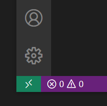

# 開発環境の構築

::: tip Note
以下は WESEEK, Inc. での統一開発環境の紹介です。
そのため、開発にあたって必須ではない設定やツールの指定が含まれています。
:::

## 各種ツールの準備

### 3way-merge ツール

ホストPCで作業します。

1. P4Merge (Helix Visual Client (P4V)) インストール
    * [https://www.perforce.com/downloads/helix-visual-client-p4v](https://www.perforce.com/downloads/helix-visual-client-p4v) からDLしてインストールする
    * ユーザ登録は適宜実施する
2. P4Merge 設定
    * Diff タブで適当にファイルを2つ選択して OK
    * Edit -&gt; Preferences...
        * 「Character encoding」で「Unicode (UTF-8, no BOM)」または BOM 表記のない「Unicode(UTF-8)」を選択
        * 「Line ending type」で「UNIX (LF)」を選択

### Git のための GUI クライアント

::: tip WESEEK Rule
ブランチ操作、reset, rebase 操作に慣れていない人は必ず GUI クライアントをセットアップし、樹形図を常に確認しながら開発を進めましょう。
:::

ホストPCで作業します。

1. SourceTreeインストール
    * [https://ja.atlassian.com/software/sourcetree](https://ja.atlassian.com/software/sourcetree) からDLしてインストールする
    * 「Git が見つかりませんでした」というダイアログが表示された場合は、「システム全体でなく、SourceTree 単独で使うためだけの内蔵用の Git をダウンロードする。」を選択
2. SourceTree設定
    1. SourceTree からターミナルを開く
    2. autoCRLF を無効化する
        * 以下をコピペして実行 `git config --global core.autoCRLF false`
    3. 自身のアカウント情報を設定
        * 「ツール &gt; オプション &gt; 全般」...
        * 「デフォルトのユーザ情報」を適宜設定
    4. P4Merge を設定
        * 「ツール &gt; オプション &gt; Diff」...
        * 「外部Diffツール」「マージツール」で「P4Merge」を選択
    5. デフォルトの文字コード設定
        * 「ツール &gt; オプション &gt; 全般」...
        * 「デフォルトの文字コード」で「utf-8」を選択

### MongoDB のための GUI クライアント

1. [Robo 3T](https://robomongo.org/download) をインストール


## docker, docker-compose 実行環境のインストール

ホストPCで作業します。

:::: tabs

::: tab "Windows" id="tab-docker-win"

※下記手順は、Virtualbox との併用を行わない手順になります

1. WSL2 を利用可能な状態にする
    1. [WSL2 Linux カーネル更新プログラム パッケージ](https://docs.microsoft.com/ja-jp/windows/wsl/wsl2-kernel) をインストール
    1. 管理者権限で起動した PowerShell で以下を実行

        ```bash
        # Hyper-V の無効化
        Disable-WindowsOptionalFeature -Online -FeatureName $("Microsoft-Hyper-V")
        # WSL の有効化
        Enable-WindowsOptionalFeature -Online -FeatureName $("VirtualMachinePlatform", "Microsoft-Windows-Subsystem-Linux")
        ```

    1. Microsoft Store で Ubuntu をインストール
        * アプリ名にバージョンが入っていない「Ubuntu」アプリを推奨
            * その時点の最新版(Ubuntu 20.04 LTS 等)へのエイリアスになっている
        * 単体で起動してユーザー作成、ログインまで済ませる
        * 確認

            ```bash
            > wsl -l -v
            NAME      STATE           VERSION
            * Ubuntu    Stopped         2
            ```

        * VERSION 1 で動いている場合は、更に `wsl --set-version Ubuntu 2` を打ち込んでディストリビューションの更新を行う

1. [Docker Desktop](https://www.docker.com/products/docker-desktop) をインストール

:::

::: tab "Mac" id="tab-docker-mac"

1. [Docker Desktop](https://www.docker.com/products/docker-desktop) をインストール

:::

::::


## Git 設定

devcontainer は 自動的に docker ホストの設定を拝借します。  
ここではコンテナ内部から参照するためのホスト側の設定を行います。

:::: tabs

::: tab "Windows" id="tab-git-configuration-win"

1. docker ホストとなる WSL2 のターミナルで以下を実行

    ```bash
    # name, email の設定
    git config --global user.name "Your Name"
    git config --global user.email "yourname@example.com"
    # Windows の場合は、WSL 内から更にホストPCの credential helper を参照する設定を行う
    git config --global credential.helper "/mnt/c/Program\ Files/Git/mingw64/libexec/git-core/git-credential-manager.exe"
    ```

1. ホスト PC で credential helper を利用するため、以下の設定を行う
    <https://help.github.com/en/github/using-git/caching-your-github-password-in-git>

:::

::: tab "Mac" id="tab-git-configuration-mac"

1. ホストPCのターミナルで以下を実行

    ```bash
    # name, email の設定
    git config --global user.name "Yuki Takei"
    git config --global user.email "yuki@weseek.co.jp"
    ```

1. credential helper を利用するため、以下の設定を行う
    <https://help.github.com/en/github/using-git/caching-your-github-password-in-git>

:::

::::


## Visual Studio Code のセットアップ

1. [Visual Studio Code](https://code.visualstudio.com/download) をインストール
2. 拡張機能をインストール
    * 「Remote - Development」extension のインストール
    * 「Docker」extension のインストール


## ワークスペース準備

devcontainer で開発を行うには、以下のような構造のディレクトリツリーが必要です。

```
- GROWI
    - growi                   <-- weseek/growi repository
    - growi-docker-compose    <-- weseek/growi-docker-compose repository
    - node_modules            <-- an empty directory for developing plugin
```

### 手順

* Windows の場合は WSL 内、Mac の場合はホストPCで作業します

::: warning
**事前チェック**
`git config -l --global` で、autoCRLF が false になっていることを確認しましょう
:::

```bash
mkdir -p ~/Projects/GROWI
cd ~/Projects/GROWI
git clone https://github.com/weseek/growi.git
git clone https://github.com/weseek/growi-docker-compose.git
# プラグイン開発時に利用する空のディレクトリを作成
mkdir node_modules
```

### SourceTree のリポジトリリストに登録

* 上の手順で clone したリポジトリを登録
  * Windows の場合は WSL のパス: `\\wsl$\Ubuntu\home\{your account}\Projects\GROWI\growi`


## GROWI-Dev devcontainer の起動

1. VSCode を起動
1. リモート接続用インジケーターから、devcontainer でリポジトリを開く
    * 
    * Remote-Containers: Open folder in Container...
    * weseek/growi ローカルリポジトリを選択
        * Windows の場合は WSL のパス: `\\wsl$\Ubuntu\home\{your account}\Projects\GROWI\growi`
1. 初回は各種コンテナイメージのダウンロードとビルドのため、5～10分待つ

### 確認

エラーなく起動したら、以下の確認を行ってください。  
GROWI-Dev devcontainer ウィンドウ内で作業します。


#### Git 設定

* ターミナルで、Git の設定を出力し、Windows であれば WSL のグローバル設定、Mac であればホストPCのグローバル設定が反映されていることを確認する

    ```bash
    node@4a51dae04bb4:/workspace/growi-docs$ git config -l --show-origin
    file:/home/node/.gitconfig      user.name=Your Name
    file:/home/node/.gitconfig      user.email=yourname@example.com
    file:/home/node/.gitconfig      credential.helper=!f() { /home/node/.vscode-server/bin/a5d1cc28bb5da32ec67e86cc50f84c67cc690321/node /tmp/vscode-remote-containers-c717012556037588bd78c4b869724bf548d49841.js $*; }; f
    file:.git/config        core.repositoryformatversion=0
    file:.git/config        core.filemode=true
    file:.git/config        core.bare=false
    file:.git/config        core.logallrefupdates=true
    file:.git/config        remote.origin.url=https://github.com/weseek/growi.git
    file:.git/config        remote.origin.fetch=+refs/heads/*:refs/remotes/origin/*
    file:.git/config        branch.master.remote=origin
    file:.git/config        branch.master.merge=refs/heads/master
    ```

  * `credential.helper` に関しては、上記のようなスクリプトがセットされている状態が正常


#### ミドルウェア群のコンテナの起動

* サイドバーの Docker メニューで5つのコンテナの起動を確認
  * 


## トラブルシュート

### Remote WSL の接続に失敗する場合

#### 症状

```
sh: 1: /scripts/wslServer.sh: not found
```

#### 対処

1. VSCode のアンインストール
1. `C:\Users\${YourAccount}\.vscode` の削除
1. 再度 VSCode のインストールから
