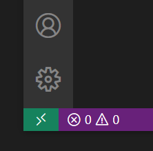
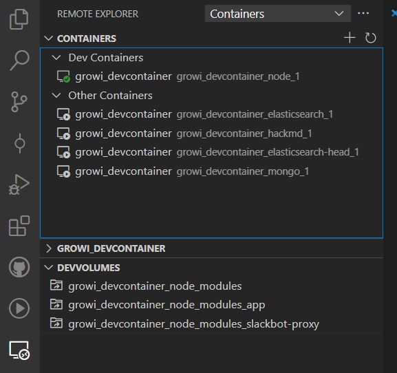

# devcontainer の起動

::: tip Note
以下は WESEEK, Inc. で統一している開発環境の紹介です。
そのため、開発にあたって必須ではない設定やツールの指定が含まれています。
:::


## ワークスペース準備

devcontainer で開発するには、以下のような構造のディレクトリツリーが必要です。

```
- GROWI
    - growi                   <-- weseek/growi repository
    - growi-docker-compose    <-- weseek/growi-docker-compose repository
```

* 以下の手順を、Windows の場合は WSL 内、Mac の場合はホストPCで作業します

::: warning
**事前チェック**
`git config -l --global` で、autoCRLF が false になっていることを確認しましょう
:::

```bash
mkdir -p ~/Projects/GROWI
cd ~/Projects/GROWI
git clone https://github.com/weseek/growi.git
git clone https://github.com/weseek/growi-docker-compose.git
```


## コンテナの起動

1. VSCode を起動
1. リモート接続用インジケーターから、devcontainer でリポジトリを開く
    * 
    * Remote-Containers: Open folder in Container...
    * weseek/growi ローカルリポジトリを選択
        * Windows の場合は WSL のパス: `\\wsl$\Ubuntu\home\{your account}\Projects\GROWI\growi`
            * `{your account}` は自身のアカウント名に変更
1. 初回は各種コンテナイメージのダウンロードとビルドのため、5～10分待つ
1. エラーなく起動したら、サイドバーの Remote Explorer メニューで5つのコンテナの起動を確認する
    * 

### コンテナの起動確認

エラーなく起動したら、以下を確認してください。  
GROWI-Dev devcontainer ウィンドウ内で作業します。

### Git 設定の確認

* ターミナルで、Git の設定を出力し、Windows であれば WSL のグローバル設定、Mac であればホストPCのグローバル設定が以下のように反映されていることを確認する

    ```bash
    node ➜ /workspace/growi (master) $ git config -l --show-origin
    ...
    file:/home/node/.gitconfig      user.name=Your Name
    file:/home/node/.gitconfig      user.email=yourname@example.com
    file:/home/node/.gitconfig      core.autocrlf=false
    file:/home/node/.gitconfig      credential.helper=!f() { /home/node/.vscode-server/bin/a5d1cc28bb5da32ec67e86cc50f84c67cc690321/node /tmp/vscode-remote-containers-c717012556037588bd78c4b869724bf548d49841.js $*; }; f
    ...
    ```

  * `credential.helper` に関しては、上記のようなスクリプトがセットされている状態が正常


## トラブルシュート

### Remote WSL の接続に失敗する場合

#### 症状

```
sh: 1: /scripts/wslServer.sh: not found
```

#### 対処

1. VSCode のアンインストール
1. `C:\Users\${YourAccount}\.vscode` の削除
1. 再度 VSCode のインストールから
