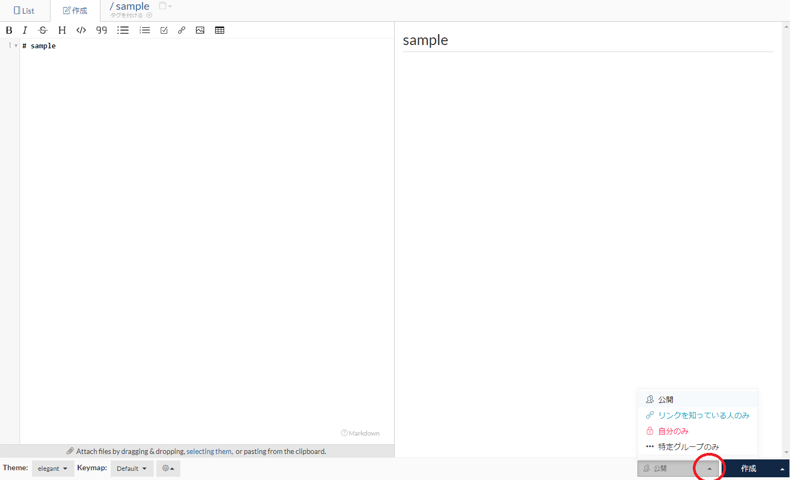
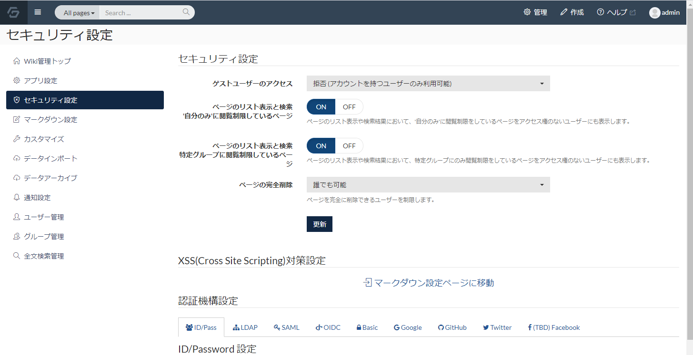
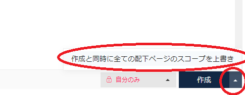

# ページの閲覧権限の設定

ページを作成している時に、特定のページについては、閲覧権限のある人しか見られないように設定したいという要望があります。

GROWI では、該当の設定が可能です。

ページに対して設定可能な閲覧権限について説明します。

## ページに対する閲覧権限の設定方法

ページの編集モードにて、画面右下に表示される「作成/更新」ボタンの左側の「公開」と表示されている部分の「▲」をクリックすると

以下の画像のように選択肢が表示されます。

この選択肢を選択後、「作成/更新」ボタンを押下する事で、閲覧権限の設定がページへ適用されます。

## 閲覧権限として設定できる種類

ページの閲覧制限として設定できる内容は、以下のいずれかを選択可能です。

### 公開

  この設定のページに対しては閲覧の制限がありません。誰でも閲覧できます。デフォルトはこの設定です。

  GROWI 全体が `ログインしないと閲覧できない設定` の場合、
  
  ページが公開の設定でもログインしないと閲覧できず、ページへアクセスしてもログイン画面へリダイレクトされます。
  ログインしているユーザーであれば誰でも閲覧できます。

### リンクを知っている人のみ
  
  この設定をしたページは、ページリストやページ検索結果には出力されなくなります。

  ページの URL が分かるユーザーのみが閲覧できるようになります。

  自分でもページ配置場所が分からなくなった場合は、ホーム画面の「Recently Created」からページを辿りましょう。
  
  自分が作成したページであれば、こちらのページ一覧には出力されます。

### 自分のみ

  この設定をしたページは、自分以外のユーザーは参照できなくなります。

  自分以外のユーザーのページリストやページ検索結果に表示されるかどうかは、管理画面の ON/OFF で設定出来ます。(後述)

  デフォルトの管理設定では、ページリストやページ検索結果には表示されます。

### 特定のグループのみ

  この設定をしたページは、設定したグループに所属するユーザーしか参照出来なくなります。

  グループに所属していないユーザーのページリストやページ検索結果に表示されるかどうかは、管理画面の ON/OFF で設定出来ます。(後述)

  デフォルトの管理設定では、ページリストやページ検索結果には表示されます。

## グループ管理機能について

詳細は [こちら](/ja/admin-guide/management-cookbook/group.md)に記載しています。

## 権限が付いたページに対しての検索結果表示やリスト表示の制御

GROWI の検索結果やページリスト表示時に、閲覧権限がない人にはページを表示したくないという場合があります。

その時は、管理メニューの`セキュリティ設定`で該当の設定のオン・オフ機能を切り替えましょう。

### ページのリスト表示と検索　'自分のみ'に閲覧制限しているページ

- ON の場合

  自分以外のユーザーのページのリスト表示や検索結果として、該当の制限をしているページが表示されます。

- OFF の場合

  自分以外のユーザーのページのリスト表示や検索結果として、該当の制限をしているページが表示されません。

### ページのリスト表示と検索　特定グループに閲覧制限しているページ

- ON の場合

  グループに所属していないユーザーのページのリスト表示や検索結果として、該当の制限をしているページが表示されます。

- OFF の場合

  グループに所属していないユーザーのページのリスト表示や検索結果として、該当の制限をしているページが表示されません。

## 閲覧権限をページ配下に一括で設定

ページは階層構造になっており、特定ページ配下のページ全てに対して、一括で権限管理したい場合があります。

その際には、ページの作成/更新時に画面右下に表示される「作成/更新」ボタンの「▲」をクリックし、

「作成/更新と同時に全ての配下ページのスコープを上書き」をクリックして下さい。

この操作で、該当ページ配下の全てのページに対して、同じ権限設定を適用することが出来ます。

## 権限の設定例

基本的には、閲覧権限が必要なページはまとめて整理して、ページ配下を一括で権限更新すると管理が簡単になります。

もしページ構成の変更に問題がなければ、権限が必要なページは以下の例のように移動してしまいましょう。

- グループ名のページを作成する

- 該当グループのみ閲覧権限を持たせたいページを、そのページ配下へ移動する

- グループ名のページを一括で権限設定する
