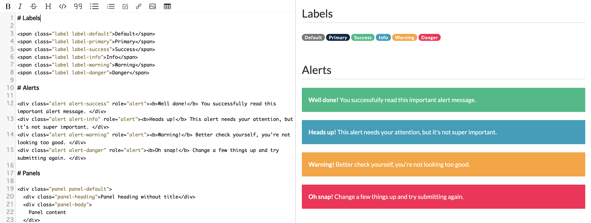

# Bootstrap を使ってページを装飾する

GROWI では bootstrap を用いたページの装飾を行うことができます。

HTML を記述することもできるので、 bootstrap の class と組み合わせることで彩りのあるページを作ることができます。

詳細は bootstrap のページと、[GROWI のデモサイトの記述例](https://demo.growi.org/Sandbox/Bootstrap3#edit)を参考にしてください