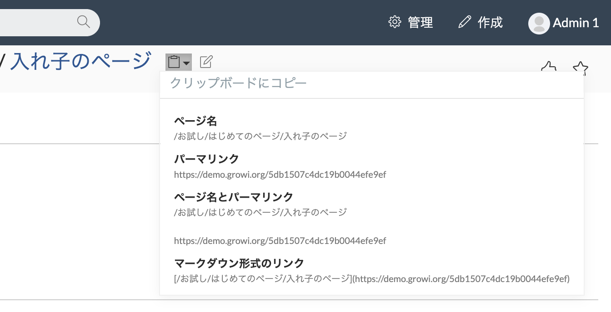

# タイトルや URL をクリップボードにコピーする

ページタイトル横にあるクリップボードのアイコンをクリックすることで、ページタイトルや、ページの URL をクリップボードにコピーできます。

ページ内容を他の方へ共有するときに便利です。

* ページ名
  * ページのタイトルのみをコピーします
* パーマリンク
  * ページへの URL をコピーします
* ページ名とパーマリンク
  * ページのタイトルと URL をコピーします
* マークダウン形式のリンク
  * Markdown のリンクの形式でタイトルと URL をコピーします
