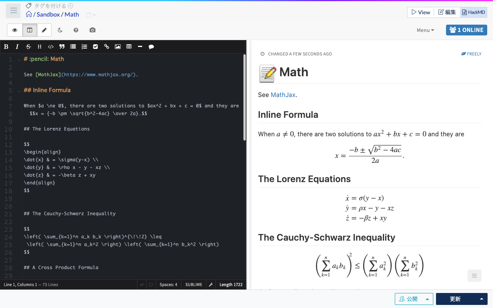
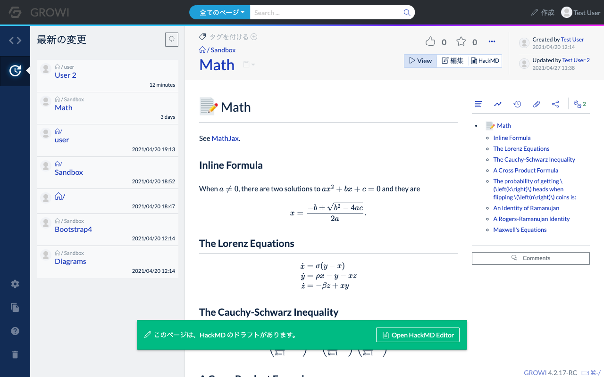
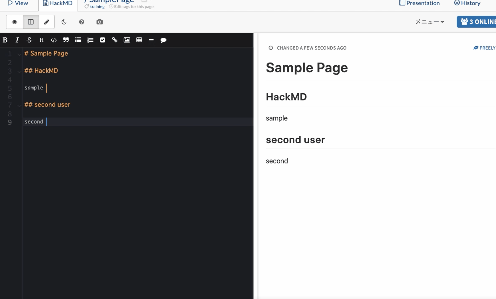

# HackMD で同時多人数編集を利用する

GROWI では、HackMD と連携することでひとつのページを同時に多人数で編集する機能を利用できます。

使い方について説明します。

## HackMD とは

HackMD とは、Markdown で書いたドキュメントを複数人で編集でき、リアルタイムプレビューが可能なツールです。

オープンソースとしても公開されています。

GROWI では HackMD と連携させることで、GROWI 管理下のドキュメントを同時に多人数で編集することができるようになります。

## HackMDを利用するための設定について

HackMD を使うためには、予め GROWI と HackMD の連携が設定されている必要があります。

この設定については、別途の[管理者ガイドのページ](/admin-guide/admin-cookbook/integrate-with-hackmd.html)を参照してください。

以下、HackMD を利用できるよう設定された GROWI 環境であることを前提に説明します。

## HackMD モードでページを編集しよう

ページの参照編集モード切替のタブで、以下の画像で赤丸をつけた HackMD のタブを選択する事で、HackMD モードでの編集となります。

HackMD は一人でも利用できますが、ここでは 2つのユーザーアカウントで HackMD を利用してページ編集する方法を説明します。

### HackMDモードでの編集開始

ユーザーA と ユーザーB が同じページを同時に編集します。

1. ユーザーA が ページ編集のタブ `HackMD` をクリック

   クリックすると、`HackMD is READY!` という表示と、`Start to edit with HackMD` のボタンが表示されます。

   

1. `Start to edit with HackMD` のボタンをクリック

   クリックすると、下記の画像のように、HackMD モードでの編集が開始されます。

   

これだけで HackMD モードでの編集となっています。

続いて、このページに対してユーザーB が同時編集者として参加します。

### 2名目以降の参加

ユーザーB が先ほどのページを参照すると、画面下部に以下の画像のように  
`This page has a draft on HackMD >>  Open HackMD Editor` と表示されています。

この時、view / 編集 / HackMD のタブで HackMD 部分を選択するか、画面下部の  
`Open HackMD Editor` リンクをクリックします。

すると、ユーザー A の時と同様の `Start to edit with HackMD` のボタンが表示されるか、  
`Resume to edit with HackMD` のボタンと `Discard changes of HackMD` のボタンが並んだ画面が表示されます。

### `Start to edit with HackMD` ボタンが表示される

ページを誰も編集していない、または編集した内容が保存されている状態の時に HackMD ボタンをクリックしたときは、
`Start to edit with HackMD` ボタンが表示されます。

### `Resume to edit with HackMD` ボタンと `Discard changes of HackMD` ボタンが表示される

別のユーザーが既に HackMD によるページ編集中で、  
`HackMD モードで編集した内容がまだ保存されていない状態`の時に HackMD ボタンをクリックしたときは、  
`Resume to edit with HackMD` ボタンが表示されます。

### `Resume to edit with HackMD` ボタン

ページを HackMD モードで編集している別のユーザーの編集内容を引き継いで HackMD モードで画面を開く

### `Discard changes of HackMD` ボタン

ページを編集している別のユーザーの保存前の編集内容を破棄して HackMD モードで画面を開く

Discard ボタンを押すと、新たに `Start to edit with HackMD` ボタンが表示されます。

Discard ボタン押下後に表示された `Start to edit with HackMD` ボタンを押すと、  
別のユーザーが HackMD モードで編集作業していた内容は破棄され、
HackMD モードの全ユーザーの編集画面がページを最後に保存した状態になります。

:::warning
Discard ボタン押下後の `Start to edit with HackMD` ボタン押下の操作は、  
他のユーザーの HackMD モードでの編集中の内容を破棄する操作となりますので、ご注意ください。
:::

## 記事の同時編集操作

1名以上の複数のユーザーが同時に編集できます。

2ユーザーが同時に操作すると、以下のようになります。

### ユーザーAの操作画面
<!-- TODO: Update photo -->

### ユーザーBの操作画面
<!-- TODO: Update photo -->

編集カーソルが複数現れ、各画面で同時に編集操作が可能となります。

## 編集内容の保存

同時編集中に、誰か 1ユーザーがページの更新ボタンを押下する事で、全員の編集内容がページに保存されます。

更新ボタンを押下したユーザーは HackMD モードから参照モードへ移行しますが、

その他のユーザーは引き続き HackMD モードで編集が可能となります。

HackMD モードで Windows なら Ctrl + S キー、Mac なら Command + S キー のショートカットを押すと、HackMD モードのままページが保存できます。

## HackMD モード利用時の注意

::: warning
あるユーザーが HackMD モードで編集している最中に、別のユーザーがビルトインのエディタ(HackMD ではない方の編集モード)で保存してしまうと、
ページ編集情報が競合し、HackMD 側で更新ボタンが機能しなくなります。

この状態では、ページ更新を行った後も HackMD モードでは編集を開始することができず、  
`DRAFT MAY BE OUTDATED` のアラートが表示されます。
<!-- TODO: Update photo -->

<!-- TODO: Update photo -->

HackMD モードでの編集より通常の編集モードでの更新（保存）が優先されてしまいますので、この表示が出た時には  
 `Discard it` のリンク や `Discard changes of HackMD` ボタンをクリックし、
ページの最新 version から新たに編集を開始するようにしてください。

※ その時、HackMD 上で編集していた内容は破棄されてしまいます。
:::
