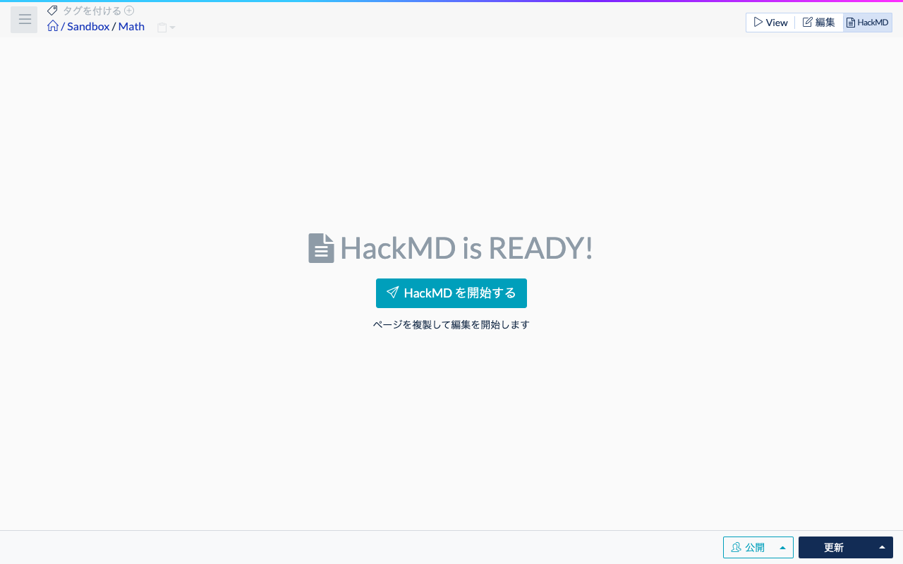
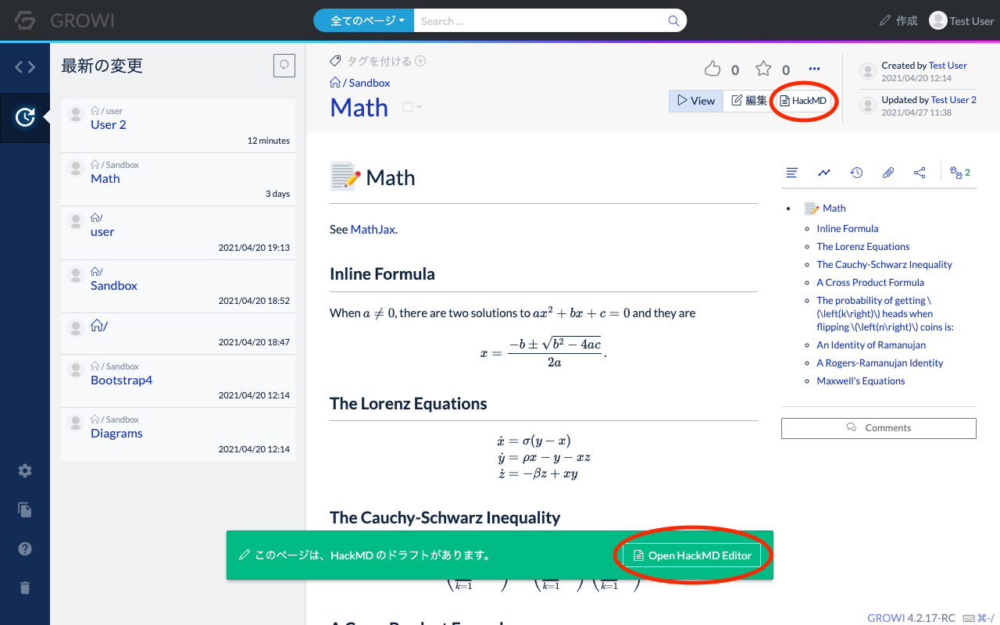
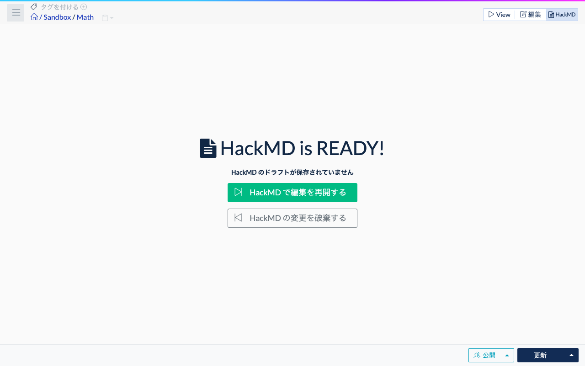
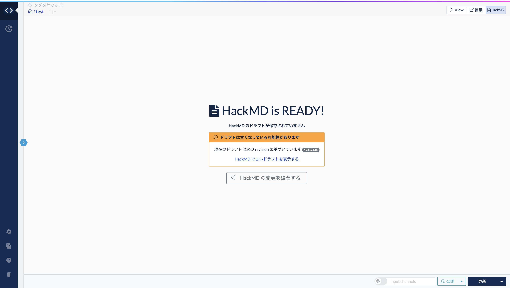

# HackMD で同時に多人数で編集する

GROWI では、HackMD と連携することで、1つのページを同時に多人数で編集する機能を利用できます。

このページでは、HackMD の使い方について説明します。

[[toc]]
## HackMD とは

HackMD とは、Markdown で書いたドキュメントを多人数で編集でき、リアルタイムプレビューが可能なツールです。オープンソースとしても公開されています。

GROWI では HackMD と連携させることで、GROWI 管理下のドキュメントを同時に多人数で編集できるようになります。

## HackMDを利用するための設定をする

HackMD を使うためには、あらかじめ GROWI と HackMD の連携が設定されている必要があります。  
この設定については、管理者ガイドの[HackMD(CodiMD)連携](/ja/admin-guide/admin-cookbook/integrate-with-hackmd.html)を参照してください。

以下、HackMD を利用できるよう設定された GROWI 環境であることを前提に説明します。

## HackMD モードでページを編集する

ページの View / 編集 / HackMD モード切替タブで、以下の画像で赤丸をつけた HackMD のタブを選択すると、HackMD モードで編集できます。

HackMD は1人でも利用できますが、ここでは2つのユーザーアカウントで HackMD を利用してページ編集する方法を説明します。

### HackMDモードで編集を開始する

ユーザーA と ユーザーB が同じページを同時に編集する手順を説明します。

1. ユーザーA が ページ編集のタブ `HackMD` をクリック

   クリックすると、`HackMD is READY!` という表示と、`Start to edit with HackMD (HacKMDを開始する)` のボタンが表示されます。

   

1. `Start to edit with HackMD (HacKMDを開始する)` のボタンをクリック

   クリックすると、以下の画像のように、HackMD モードでの編集が開始されます。

   

### 2人目の編集者が HackMD モードの編集に参加する

続いて、このページに対してユーザーB が同時編集者として参加します。

1. ユーザーB が先ほどのページを参照する

    画面下部に以下の画像のように `This page has a draft on HackMD >>  Open HackMD Editor` と表示されます。

1. View / 編集 / HackMD のタブで HackMD 部分を選択するか、画面下部の `Open HackMD Editor` リンクをクリックします。

1. 以下のいずれかの画面が表示されます。

    - ユーザー A の時と同様の `Start to edit with HackMD (HacKMDを開始する)` のボタン

    - `Resume to edit with HackMD (HacKMDで編集を再開する)` のボタンと `Discard changes of HackMD (HacKMDの変更を破棄する)` のボタン

### 各ボタンについて
#### `Start to edit with HackMD` ボタンが表示される条件

- ページを誰も編集していない、または編集した内容が保存されている状態

#### `Resume to edit with HackMD` ボタンと `Discard changes of HackMD` ボタンが表示される条件

- 別のユーザーが既に HackMD によるページ編集中で、HackMD モードで編集した内容がまだ保存されていない状態

#### `Resume to edit with HackMD` ボタンの動作

- ページを HackMD モードで編集している別のユーザーの編集内容を引き継いで HackMD モードで画面を開く

#### `Discard changes of HackMD` ボタンの動作

- ページを編集している別のユーザーの保存前の編集内容を破棄して HackMD モードで画面を開く
- `Discard changes of HackMD` ボタンを押すと、新たに `Start to edit with HackMD` ボタンが表示される

:::warning

この時表示された　`Start to edit with HackMD` ボタンを押すと、他のユーザーが HackMD モードで編集していた内容は破棄されます。同じページを編集していたすべてのユーザーの編集画面が最後に保存したページの内容になりますので、ご注意ください。
:::

### 複数のユーザーが同時にページを編集した場合の動作

2ユーザーが同時に操作すると、以下のように編集カーソルが複数現れ、各画面で同時に編集できるようになります。

#### ユーザーAの操作画面

#### ユーザーBの操作画面

### 編集内容を保存する

同時編集中に、ある 1ユーザーがページの更新ボタンを押すと、全員の編集内容がページに保存されます。

更新ボタンを押したユーザーは HackMD モードから参照モードへ移行しますが、その他のユーザーは引き続き HackMD モードで編集できます。

HackMD モードで Windows なら Ctrl + S キー、Mac なら Command + S キー のショートカットを押すと、HackMD モードのまま変更内容を保存できます。

## HackMD モード利用時の注意

::: warning

あるユーザーが HackMD モードで編集している際に、別のユーザーが通常の編集モードで保存すると、HackMD モードでの編集より、通常の編集モードでの更新・保存が優先されます。

この場合、ページ編集情報が競合し、HackMD 側で更新ボタンが機能しなくなります。この状態では、ページを更新したあとも HackMD モードでは編集を開始できず、`DRAFT MAY BE OUTDATED` のアラートが表示されます。

この表示が出た時には `Discard it` のリンク や `Discard changes of HackMD` ボタンをクリックし、ページの最新 version から新たに編集を開始してください。この時、HackMD 上で編集していた内容は破棄されますので、ご注意ください。

:::
