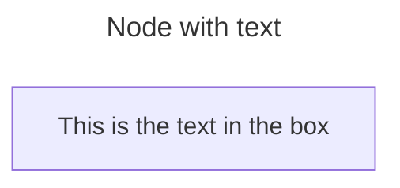
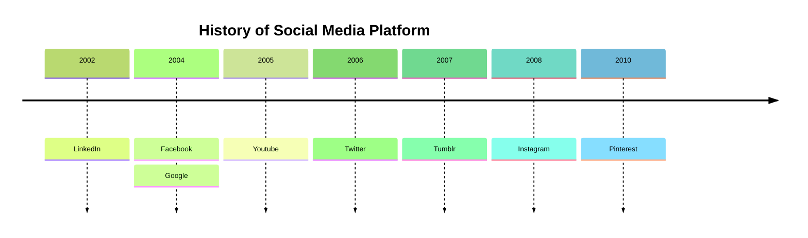

# Mermaid で図を作成する

GROWI では [Mermaid](https://mermaid.js.org/) を利用して、様々な図を書くことができます。
具体的な記法は [Syntax and Configuration](https://mermaid.js.org/intro/n00b-syntaxReference.html) などをご参照ください。

### 記法例1

~~~ mermaid

~~~

### 記法例2

~~~ mermaid

~~~

