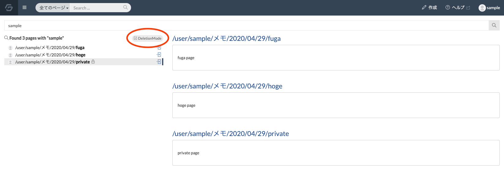
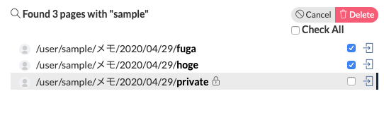
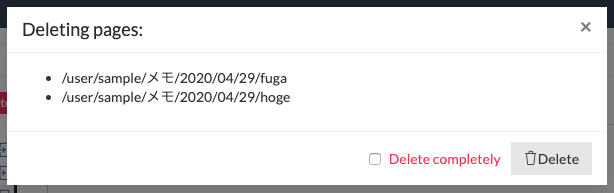

# ページを一括削除する

検索結果一覧画面で、複数のページを一括で削除する方法を紹介します。

:::warning
この機能は検索機能を利用しているため、検索機能がセットアップされている必要があります。
:::

1. ページトップバーの検索バーから削除したいページがヒットするような検索キーワードを入力し、Enter (return) を押します。
2. 検索結果一覧画面に遷移するので、ページ名リスト上部の「Deletion Mode」ボタンをクリックします。
  
3. 削除したいページのチェックボックスにチェックを入れ、「Delete」ボタンを押します。
  

4. モーダルに削除するページのリストが表示されるので、確認して「Delete」ボタンを押すとページが削除されます。
  
  - 「Delete completely」にチェックを入れて削除すると、完全削除が実行されます。
  - 削除権限がないページの削除はスキップされます。