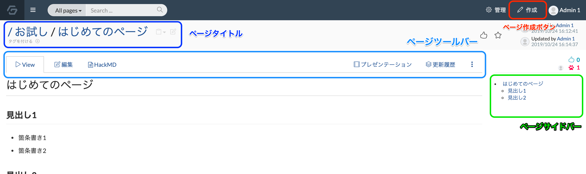

# GROWI のページレイアウト

GROWI を快適に操作するために、まずは基本レイアウトを把握しましょう。

## ページタイトル

ページのタイトルがここに表示されます。
ここで [タイトルや URL をクリップボードにコピー](./copy_to_clipboard.md) したり、ページにタグをつけることができます。

## ページツールバー

ページに関する操作を行うツールバーです。

ページの編集はもちろん、[更新履歴の確認](./history.md)や[ページの移動/複製/削除](./page_operation.md)などもこのページツールバーから行います。

## ページサイドバー

ページ内に見出しを書くと、ここにサイドバーとして見出し一覧が表示されます。

ページのコンテンツが長くなったときなどにサイドバーを使うと、すぐに目的の場所にジャンプすることができます。

## ページ作成ボタン

ページを作成するためのボタンは画面右上にあります。

定期的なページを作成することができたり、テンプレート機能を使ったページの新規作成をすることができます。