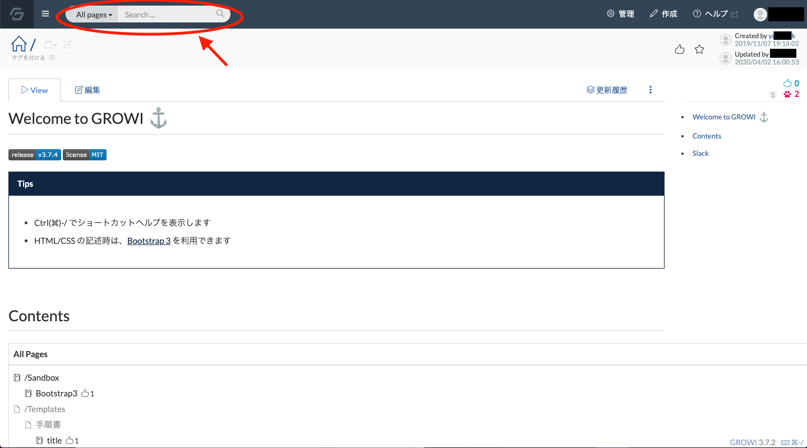

# ページを検索する

:::warning
この機能を利用するには検索用DBとして Elasticsearch 6.x と接続する必要があります。設定方法は [こちら](../admin-guide/admin-cookbook/setting-elasticsearch.md)
:::

ページトップバーの検索バーから、ページパス、本文、タグによりページを検索することができます。(検索のための環境が未完了の場合は表示されません。)

検索バーにキーワードを入力すると、以下のようにページパスがキーワードと部分的に一致するページの候補が表示されます。この候補からページにアクセスすることができます。

また、検索バーないの虫眼鏡アイコンもしくは Enter(return) キー押下により、ページパスまたは本文にキーワードを含むページが一覧表示されます。この時、検索バー左側のドロップダウンから「All pages」と「この階層下の子ページ」を選択することで、検索範囲を変更できます。

### 検索オプション
以下のような検索オプションを利用できます。
| オプション | 概要 | 表記例 | 結果 |
| --- | --- | --- | --- |
| 複数のキーワードによる検索 | スペースを挟んで複数単語を指定するとページ名か本文にそれら全てを含むページを検索します。 | `word1` `word2` | ページ名か本文に `word1` , `word2` の両方を含むページを検索 |
| 指定の文章を本文に含むページを検索 | ダブルクウォートで文章を挟むと、その文章を本文に含むページを検索します。 | `"This is GROWI"` | `"This is GROWI"` を本文に含むページを検索 |
| キーワードによる除外 | 半角のハイフン `-` の後にキーワードを指定すると、ページ名か本文にそのキーワードを含むページを除外します。 | `-keyword` | ページ名か本文に `keyword` を含むページを除外します。 |
| ページ名の先頭一致による検索 | `prefix:/user/` | `prefix:` の後にページ名を指定すると、`prefix:` から

## 検索する範囲を変更する

## 指定のタグをもつページを検索する

## 検索オプション