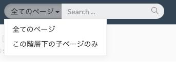
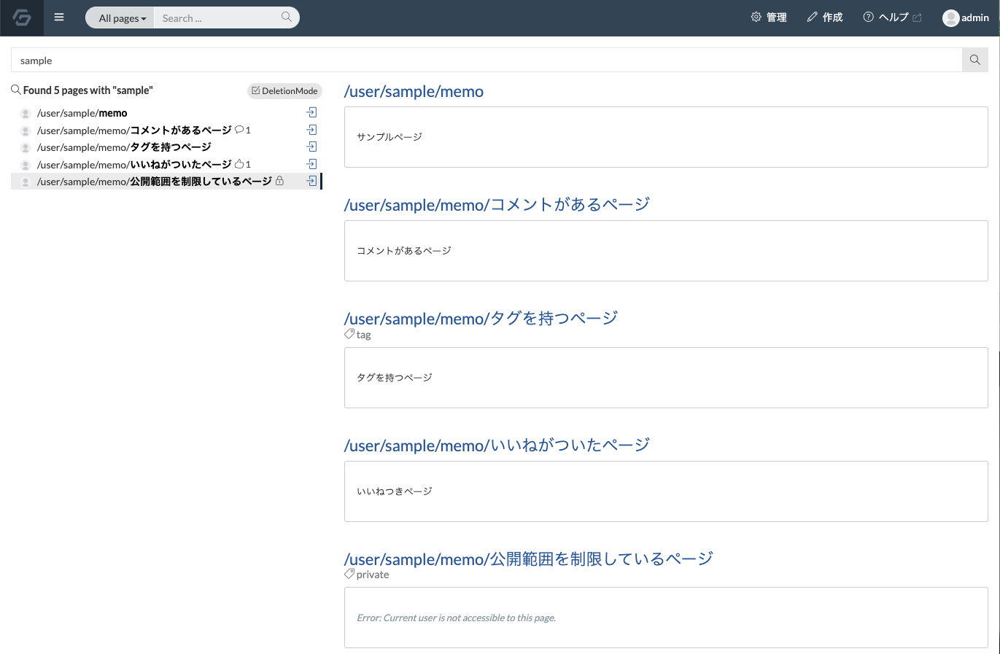
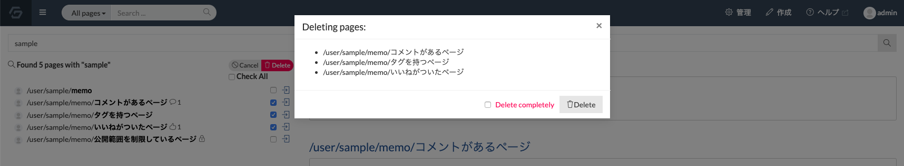

# ページを検索する

:::warning
この機能を利用するには、検索用DBとして Elasticsearch をセッティングする必要があります。設定方法は [こちら](../admin-guide/admin-cookbook/setting-elasticsearch.md)
:::

ページトップバーの検索バーから、ページパス、本文、タグによりページを検索することができます。(検索のための環境が未完了の場合は表示されません。)

検索バーにキーワードを入力すると、以下のようにページパスがキーワードと部分的に一致するページの候補が表示されます。この候補からページにアクセスすることができます。

また、検索バー内の虫眼鏡アイコンもしくは Enter(return) キー押下により、ページパスまたは本文にキーワードを含むページが一覧表示されます。この時、検索バー左側のドロップダウンから「全てのページ」か「この階層下の子ページ」を選択することで、検索範囲を変更できます。

## 検索結果ページ

検索バーでキーワードを入力し、Enter(return) キーを押すと、以下のような検索結果一覧画面に遷移します。

- ページ名のリスト
  - 画面左側に、検索にヒットしたページ名のリストが表示されます。
  - ページ名の左側にはそのページの最終更新者のプロフィール画像が表示されます。
  - ページ名のクリックすると画面右部にそのページのプレビューが表示されます。
  - ページ名の右側にはそのページのいいね数、コメント数、公開範囲の有無などのメタ情報がアイコンで表示されます。
  - 公開範囲が制限されているページの表示に関しては管理画面のセキュリティ設定から設定できます。
  - リストの右側のアイコンからそのページに遷移することができます。
  - リストの左上にある 「DeletionMode」を押すとページ削除モードになり、チェックマークをつけたページを削除することができます。

  

- ページのプレビュー
  - 画面右側には検索にヒットしたページパスのプレビューが表示されます。
  - ページ名をクリックするとそのページに遷移することができます。
  - ページが持っているタグも表示されます。
  - そのページへの閲覧権限がない場合はプレビューは表示されません。

### 検索オプション

検索時は以下のような表記でオプションを指定できます。オプションは併用可能です。
| オプション | 概要 |
| --- | --- | --- |
| 複数のキーワードによる検索  | スペースを挟んで複数単語を指定するとページ名か本文にそれら全てを含むページを検索します。 例えば `word1 word2` とすると、ページ名か本文に `word1` , `word2` の両方を含むページを検索します。|
| 指定の文章を本文に含むページを検索 | ダブルクウォートで文章を挟むと、その文章を本文に含むページを検索します。 例えば、 `"This is GROWI"` とすると、 `"This is GROWI"` を本文に含むページを検索します。 |
| キーワードによる除外 | 半角のハイフン `-` の後にキーワードを指定すると、ページ名か本文にそのキーワードを含むページを除外します。 例えば、 `-keyword` とすると、ページ名か本文に `keyword` を含むページを除外します。 |
| ページ名の先頭一致による検索 | `prefix:` の後にページ名を指定すると、そのページ名から始まるページを検索します。 例えば、 `prefix:/user/` とすると、ページ名が `/user/` から始まるページを検索します。 |
| ページ名の先頭一致による除外 | `-prefix:` の後にページ名を指定すると、そのページ名から始まるページを除外します。  例えば `-prefix:/user/` とすると、ページ名が `/user/` から始まるページを除外します。 |
| タグによる検索 | `tag:` の後にタグを指定すると、そのタグを含むページを検索します。  例えば `tag:wiki` とすると、 `wiki` というタグを含むページを検索します。 |
| タグによる除外 | `-tag:` の後にタグを指定すると、そのタグを含むページを除外します。 例えば `-tag:wiki` とすると、 `wiki` というタグを含むページを除外します。 |