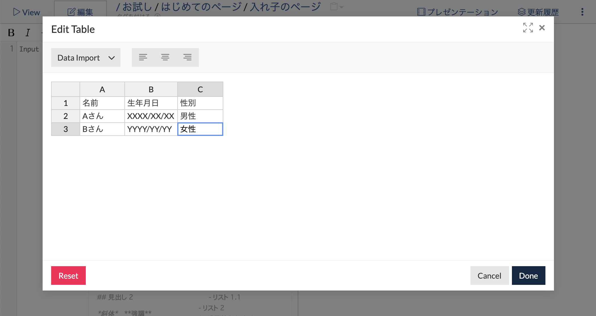
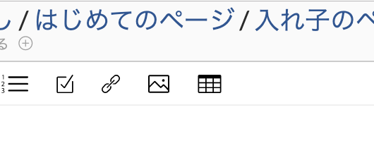
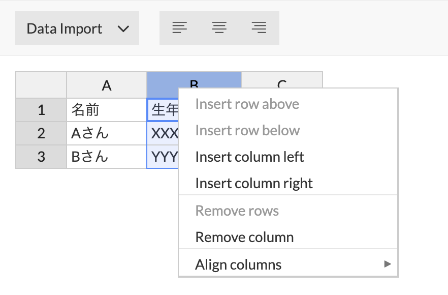
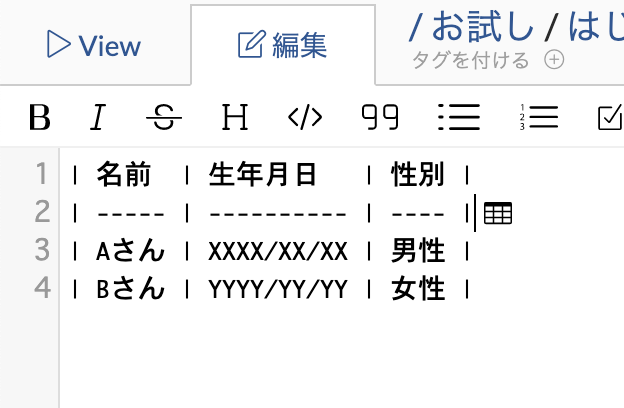

# テーブルの編集

GROWI では WYSIWYG (見たままのものを実際に作成出力) でテーブルの作成や編集をすることができます。

## テーブルの作成

ページ上部にあるツールバーからテーブルアイコンをクリックすることでテーブルを作ることができます。

## 行と列の追加

また、テーブル編集ダイアログ上で各行(ぎょう)と列(れつ)を右クリックすることで、行と列の追加を行うことができます。

## すでに書かれているテーブルを編集する

画面左側のテーブル表記の箇所にカーソルを合わせた状態でテーブルアイコンをクリックすると、すでに書かれているテーブルを編集することができます。

