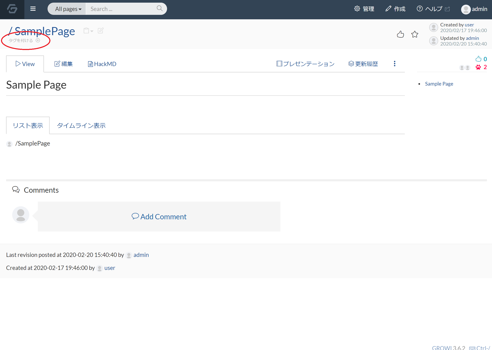
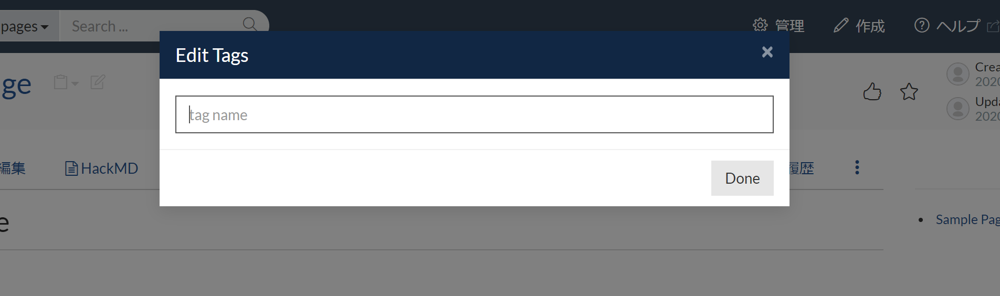
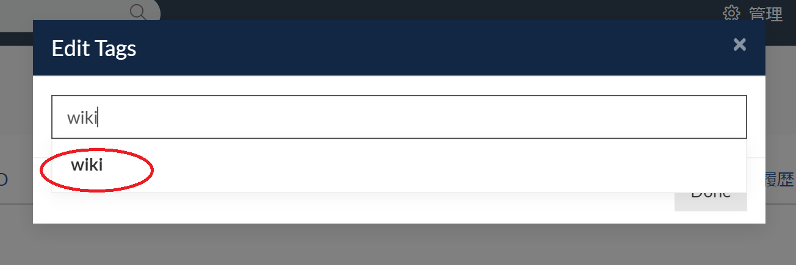
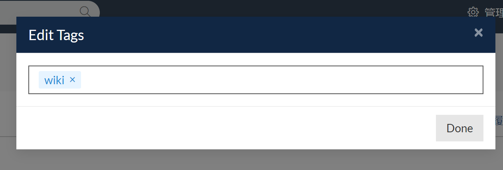
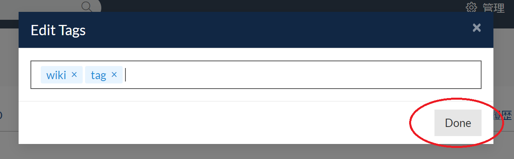
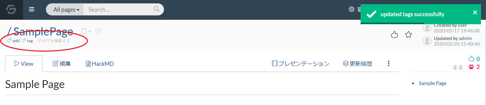
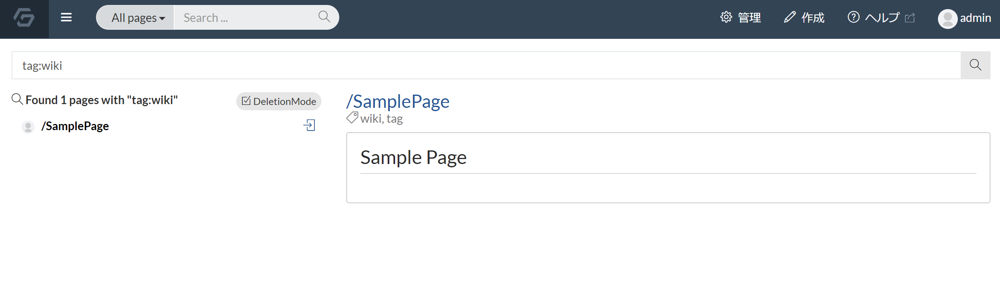
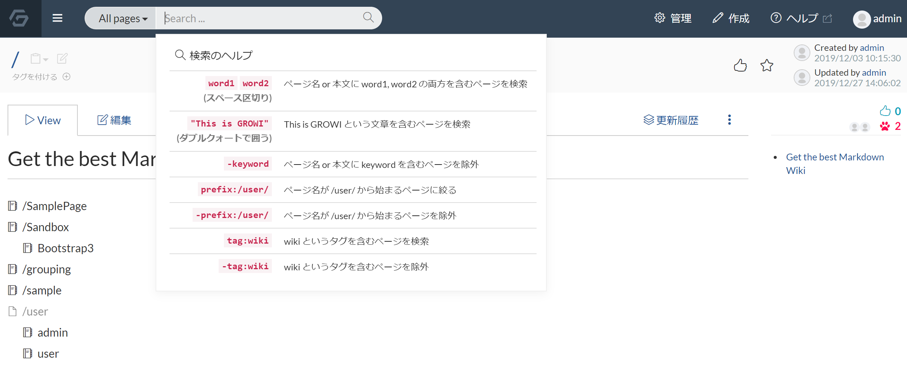
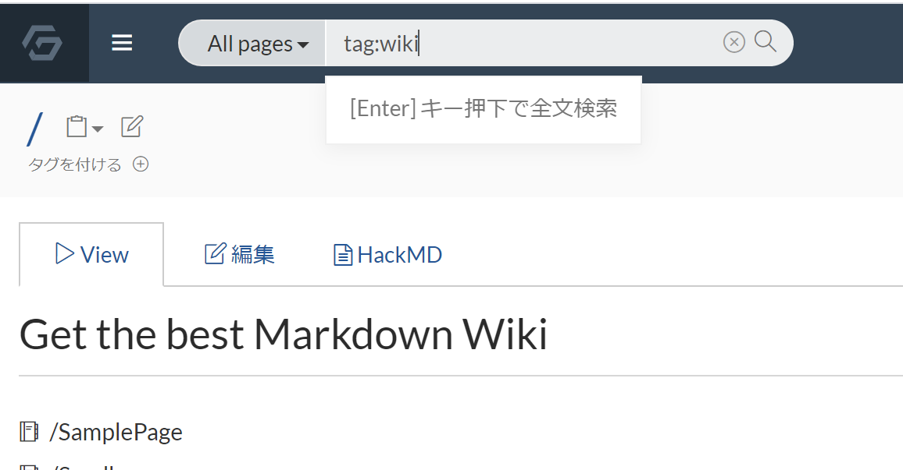
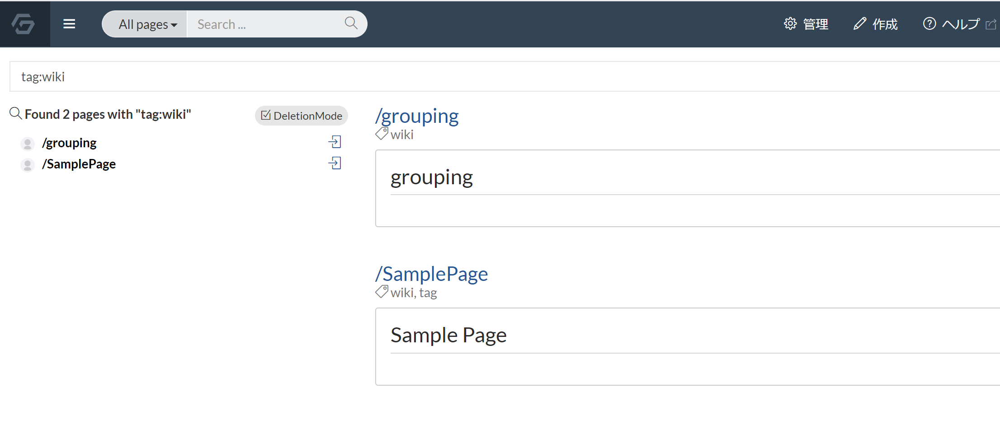

# タグを利用する

GROWI ではページパスという階層構造でページを管理するのが一般的ですが、ページに対してタグを付けることで、横断的に属性を持たせた管理も可能です。

タグを利用すれば特定のページを検索しやすくなります。

ここではタグの使い方を説明します。

## ページにタグを付ける

タグを付けたいページへ移動します。  
下記の画像の通り、ページ左上側に「タグを付ける　＋」のリンクがあります。

ページの「タグを付ける +」のリンクをクリックして、タグを追加できます。  
リンクをクリックすると下記の画像のようにタグ編集用のウィンドウが表示されます。

この入力欄で、タグとして利用したい単語を入力し、下記の画像の赤丸部分をクリックするか、Enter キーを入力します。

すると、下記の画像のように、単語が色付けされます。

この状態がタグとして設定可能な状態です。日本語のタグも利用可能です。  
複数同時にタグとして追加可能で、各タグの×ボタンでタグの削除編集もできます。

ページに付けたいタグの設定ができたら、下記の画像の通り Done ボタンをクリックします。

Done ボタンクリックにより、ページにタグが設定されます。
ページに付いたタグは、クリックすると検索が実行されます。

ページに付いたタグをクリックした結果、タグを対象にページ検索が実行されます。
<!-- textlint-disable weseek/no-doubled-joshi -->
検索結果には、同じタグが付いたページが表示されます。
<!-- textlint-enable weseek/no-doubled-joshi -->

## タグで検索する

ナビゲーションバーにある検索ボックスからも、タグを対象に検索が可能です。  
検索ボックスにカーソルを当てると、下記の画像にある通り検索のヘルプが表示されます。  

tag 検索の使い方として `tag:日本語` などの入力形式でタグを対象とした検索が可能です。

<!-- textlint-disable weseek/no-doubled-joshi -->
先ほど設定したタグが付いたページが検索結果に表示されます。
<!-- textlint-enable weseek/no-doubled-joshi -->

タグ機能も使いこなして、GROWI をより発展させましょう。
