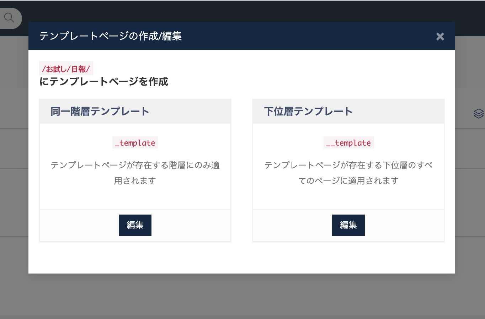
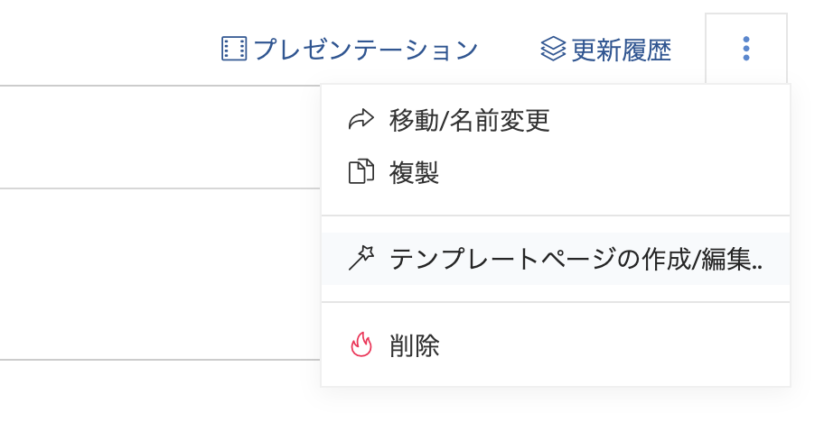
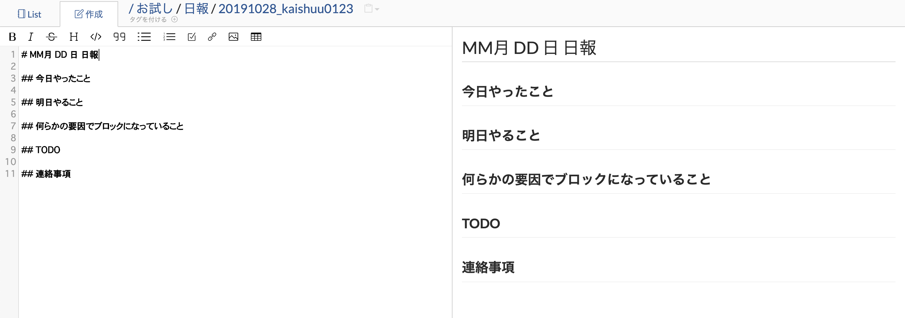

# ページテンプレートを使ってページの作成を楽にする



GROWI ではテンプレートを利用したページを作ることができます。

テンプレートを利用することで、日報(日記)やバグレポート、会議の議事録など定期的に必要になるページ作成を簡単に行うことができます。

ここでは、日報テンプレートを作成する例をご紹介します。

## テンプレートページを作成する



ページツールバーから、「テンプレートページの作成/編集」を選択します。


表示されたダイアログから、「同一階層テンプレート」を選択します。

その後に下記内容を貼り付けてページを保存してください。


```markdown
# MM月 DD 日 日報

## 今日やったこと

## 明日やること

## 何らかの要因でブロックになっていること

## TODO

## 連絡事項
```

これで定形となるテンプレートページが作成されました。

## テンプレートが適用されたページを作る

次に、テンプレートページを作成した同一階層のページに新規ページを作成します。


そうすると下記のようにテンプレートが適用された状態でページが作成されます。

編集画面に遷移するので適宜書き換えてください。



## 下位層テンプレートの使い方

定期的なページを作成したい場合には、先ほど紹介した「同一階層テンプレート」を使うことで実現できました。

一方、下位層テンプレートは GROWI wiki 全体でフォーマットを統一化したい場合などに利用できます。

例として、下記のようなテンプレートをトップページに配置することで、常にページ一覧がページ上部に表示されるページを作成できます。

`$lsx()` という記法は [weseek/growi-plugin-lsx](https://github.com/weseek/growi-plugin-lsx) によるものです。

```markdown
# 関連ページ

$lsx()

#
```