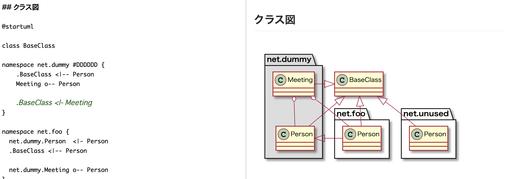

# UML を記述する



GROWI では [PlantUML](https://plantuml.com/) を利用して、UML 図を書くことができます。

具体的な記述例は [Real World UML](https://real-world-plantuml.com/) を参考にすると便利です。

**例:**

```markdown
@startuml

(PlantUML の内容)

@enduml
```