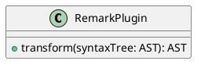

# UML 図を作成する

GROWI では [PlantUML](https://plantuml.com/) を利用して、UML 図を書くことができます。

具体的な記述例は [Real World UML](https://real-world-plantuml.com/) などをご参照ください。


## 記法1

~~~~
``` plantuml
class RemarkPlugin {
    + transform(syntaxTree: AST): AST
}
```
~~~~

## 記法2

~~~~

~~~~
