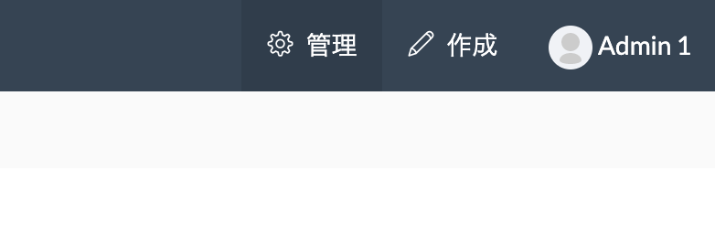
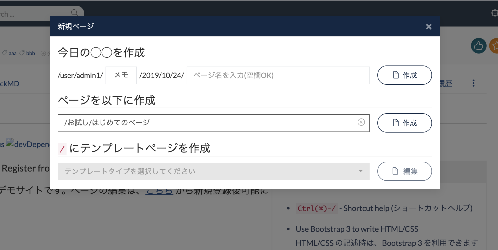
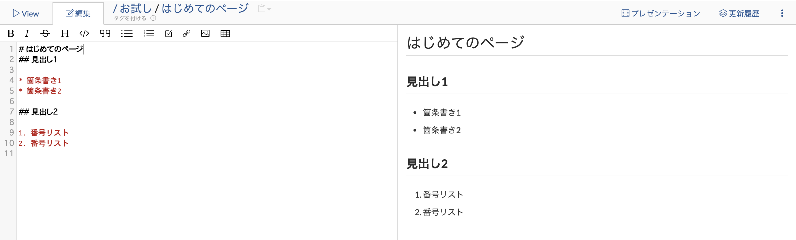
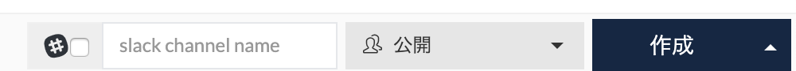
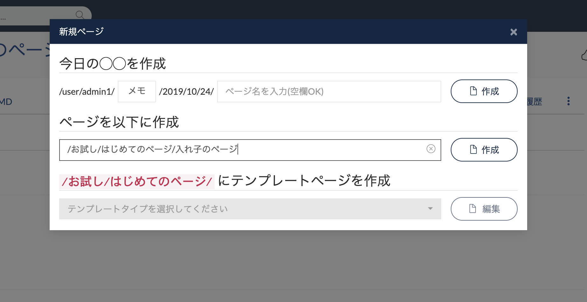
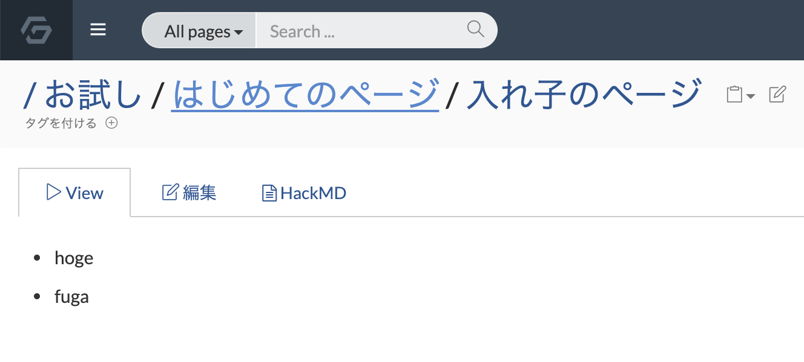
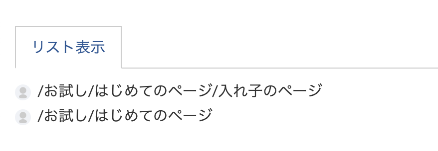

# 5分で始める GROWI

GROWI はデモサイトがあるため、簡単に始めることができます。

## デモサイトにログインする

[デモサイト](http://demo.growi.org) にアクセスして、デモサイトに掲載されているアカウントでログインしてください。

## ページを作成する

画面右上にある「作成」ボタンからページの作成をしてみましょう


ここでのタイトルは `/お試し/はじめてのページ` とします。
すでに作成されている場合には、違うページ名で作成してみてください。




その後に下記の内容をコピーします。

```markdown
# はじめてのページ
## 見出し1

* 箇条書き1
* 箇条書き2

## 見出し2

1. 番号リスト
2. 番号リスト
```

貼り付けると下記のように内容がリアルタイムに反映されたプレビューが画面右側に表示されます。



画面右下の「作成」ボタンを押して、ページを保存しましょう。



::: tip
ショートカットキーとして、 **Ctrl+s** でページを保存することもできます。
:::

## 作ったページ配下に更にページを作る

自分が作ったページ配下に更にページを追加してみましょう。もう一度画面右上にある「作成」ボタンからページを作成します。

今度はページ名を `/お試し/はじめてのページ/入れ子のページ` とします



その後に下記の内容をコピーします。

```markdown
# 入れ子のページ
## 入れ子の見出し1

* 箇条書き1
* 箇条書き2

## 入れ子の見出し2

1. 番号リスト
2. 番号リスト
```

入力が完了したら、画面右下の「作成」ボタンを押してページを保存しましょう。


## 親のページに移動する

上記作業が終わった後、表示されたページ内の「はじめてのページ」をクリックすることで、親のページに簡単に移動することができます。



## ページ配下に作成したページ一覧を確認する

ページ配下に作成したページ一覧はページ内の下の方に表示されています

