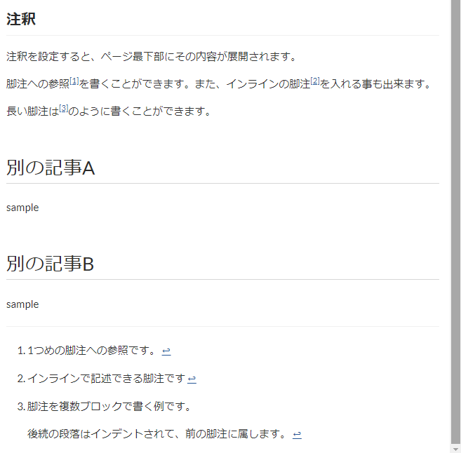

# 注釈（脚注）を追加する

GROWI では、注釈（脚注）を記述することが出来ます。

注釈を追加すると、ページ内の最下部に、脚注が表示されます。

## 注釈（脚注）の書き方

- 参照

   `[^1]` のように、脚注への参照を追加したい位置に数値記述し、注釈文章を `[^1]:` とコロンを記述して書く事が出来ます。

   `[^longnote]` のように、注釈には文字列記述を利用することも出来ます。

   注釈参照位置の `[^1]` と注釈文章の `[^1]:` を両方記述しないと、注釈として機能しません。

- インライン記法

   `[^インラインで注釈文章を追加]` のように、文章中にインラインで注釈を追加する事が出来ます。

- ブロック記法

   `[^longnote]:` の後に続く注釈文章で、インデントを付ける事で複数ブロックの内容を注釈文にする事が出来ます。（下記参考を参照）

注釈番号は、ページ内での連番が自動で振られます。

### 参考




```markdown
## 注釈
注釈を設定すると、ページ最下部にその内容が展開されます。

脚注への参照[^1]を書くことができます。また、インラインの脚注^[インラインで記述できる脚注です]を入れる事も出来ます。

長い脚注は[^longnote]のように書くことができます。

[^1]: 1つめの脚注への参照です。

[^longnote]: 脚注を複数ブロックで書く例です。

    後続の段落はインデントされて、前の脚注に属します。

# 別の記事A
sample
# 別の記事B
sample
```

上記の記述を GROWI 記事に貼りつけると、画像のように注釈（脚注）を設定する事が出来ます。
