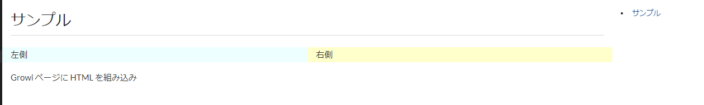
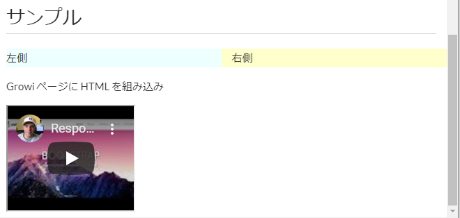

# HTML タグを組み込み



```markdown
<div class="row">
    <div class="col-sm-6" style="background-color:#EEFFFF">
        左側
    </div>
    <div class="col-sm-6" style="background-color:#FFFFCC">
        右側
    </div>
</div>
```

GROWI では、記事の編集画面に直接 HTML を埋め込む事も可能です。

上記の HTML 記述を GROWI 記事に貼りつけると、画像のように HTML が反映されます。

## iframe 組み込み



```markdown
<iframe width="30%" height="30%" src="https://www.youtube.com/embed/YE7VzlLtp-4"
frameborder="0"
allow="accelerometer; autoplay; encrypted-media; gyroscope; picture-in-picture" allowfullscreen></iframe>

(c) copyright 2008, Blender Foundation / www.bigbuckbunny.org
```

上記の iframe 記述を GROWI 記事に貼りつけると、画像のように YouTube を画面に組み込む事ができます。
