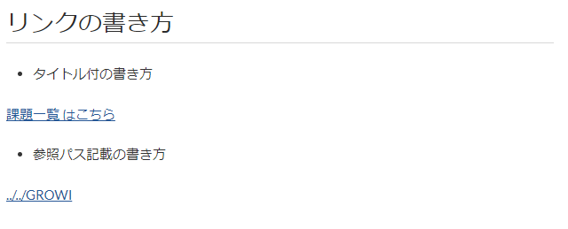

# ページリンクを記述する

GROWI では、各ページへのリンクの書き方として、以下のように参照形式で記述することが出来ます。

## ページリンクの書き方



```markdown
## リンクの書き方
- タイトル付の書き方

[[課題一覧 はこちら>../課題]]

- 参照パス記載の書き方

[[../../GROWI]]
```

上記の記述を GROWI 記事に貼りつけると、画像のようにリンクが生成されます。

書き方は、`[[` と `]]` のあいだに、タイトルとパスを記載します。

`タイトル` と `参照ページ` は `>` 記号で区切り `タイトル>参照ページ` のように記述します。

タイトルは省略可能です。参照ページは、記述中のページを基点とした相対リンクで記載出来ます。

### GitHub

このリンクの書き方は、 Pukiwiki like linker として、GROWI に組み込んでいる機能です。

[GitHub](https://github.com/weseek/growi-plugin-pukiwiki-like-linker)
