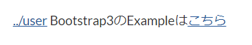

# ページリンクを記述する

GROWI では、各ページへのリンクの書き方として、以下のように参照形式で記述することが出来ます。
- Markdown 標準方式
- Crowi 互換方式
- Pukiwiki like linker方式

## Markdown 標準方式

``[表示テキスト](URL)``でリンクに変換されます。

例

```markdown
[Google](https://www.google.co.jp/)
```

[Google](https://www.google.co.jp/)

## Crowi 互換方式

書き方は、`[` と `]` のあいだに、パスを記載します。
`&lt;`の後に配下ページを`/`をつけて記載します。

例

```markdown
[/Sandbox]
&lt;/user/admin1>
```


## Pukiwiki like linker

書き方は、`[[` と `]]` のあいだに、タイトルとパスを記載します。

`タイトル` と `参照ページ` は `>` 記号で区切り `タイトル>参照ページ` のように記述します。

タイトルは省略可能です。参照ページは、記述中のページを基点とした相対リンクで記載出来ます。

例

```markdown
[[./Bootstrap3]]
Bootstrap3のExampleは[[こちら>./Bootstrap3]]
```




<!-- 

GROWI では、各ページへのリンクの書き方として、以下のように参照形式で記述することが出来ます。

## ページリンクの書き方

```markdown
## リンクの書き方
- タイトル付の書き方

[[課題一覧 はこちら>../課題]]

- 参照パス記載の書き方

[[../../GROWI]]
```

上記の記述を GROWI 記事に貼りつけると、画像のようにリンクが生成されます。

書き方は、`[[` と `]]` のあいだに、タイトルとパスを記載します。

`タイトル` と `参照ページ` は `>` 記号で区切り `タイトル>参照ページ` のように記述します。

タイトルは省略可能です。参照ページは、記述中のページを基点とした相対リンクで記載出来ます。

### GitHub

このリンクの書き方は、 Pukiwiki like linker として、GROWI に組み込んでいる機能です。

[GitHub](https://github.com/weseek/growi-plugin-pukiwiki-like-linker)
 -->