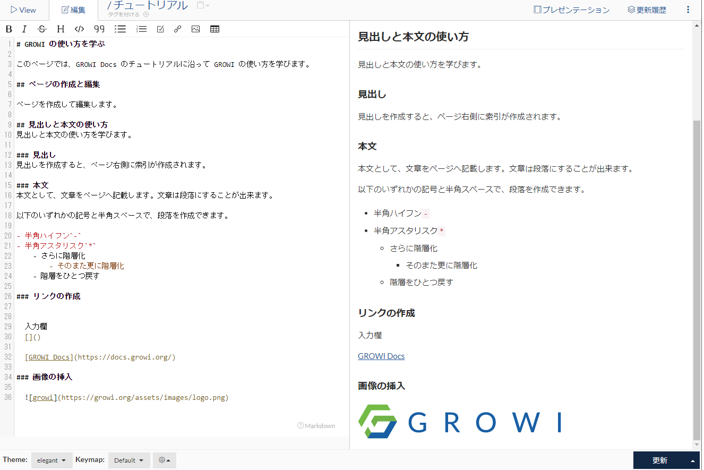

# ページを作成する

## インストール後

インストール後、GROWI の URL へアクセスすると、管理者 ID の設定を行う画面になります。

入力して、GROWI へログインすると以下の画面になります。


ここからチュートリアルを開始します。

## 新規ページ作成

GROWI は、wiki ページを作成するシステムです。

まずは新規ページ作成を行いましょう。


画面右上の「作成」ボタンをクリックすると、ページ作成が表示されます。


ボタンが複数ありますが、画像の位置にチュートリアルとページ名を入力して

作成ボタンをクリックします。


ページの編集画面になります。

以下の markdown 記述の内容をコピーして、GROWI の編集画面へ貼りつけてみましょう。

```

# はじめてのページ
## 見出し1

* 箇条書き1
* 箇条書き2
 
## 見出し2

1. 番号リスト  
2. 番号リスト

```


貼り付けると下記のように内容がリアルタイムに反映されたプレビューが画面右側に表示されます。

実際に編集画面で文字を入力し、右側のプレビュー画面への反映を確認しましょう。

編集したら、「作成」ボタンをクリックします。


クリックすると、記事が作成され、画像のようにページが参照出来るようになります。

「編集」タブと「View」タブを切り替えて、編集モードと View モードに出来ます。

早速作成したページを編集しましょう。

### 見出しと階層化

ページには半角シャープを使って見出しを付ける事が出来ます。

半角シャープは 2つ、3つと増やすごとに、階層化されます。


見出しを作成すると、ページ左側に索引が自動的に作成されるので、積極的に活用しましょう。

### 文書と階層化

ページにはテキスト文書を記載出来ます。また、その文書は階層化が出来ます。

半角ハイフン、半角アスタリスクのいずれかを利用して、段落を利用してみましょう。

```

# GROWI の使い方を学ぶ

このページでは、GROWI Docs のチュートリアルに沿って GROWI の使い方を学びます。

## ページの作成と編集

ページを作成して編集します。

## 見出しと本文の使い方
見出しと本文の使い方を学びます。

### 見出し
見出しを作成すると、ページ右側に索引が作成されます。

### 本文
本文として、文章をページへ記載します。文章は段落にすることが出来ます。

以下のいずれかの記号と半角スペースで、段落を作成できます。

- 半角ハイフン`-`
- 半角アスタリスク`*`
    - さらに階層化
        - そのまた更に階層化
    - 階層をひとつ戻す

```

一つ目の段落の次の行を開始する時に、半角スペースを2つまたは Tab キーを入力してインデントして文章を書いてください。


段落として文書が階層化されるのがプレビュー画面で確認できます。

本文の階層化で、文書の内容を整理しましょう。


文章が長くなったら、積極的に階層化するのも読みやすい wiki 作成のポイントです。

### Web ページへのリンクを作成

- Wiki ページへのリンクを作成
  
  編集画面上部のボタンで、リンク用の入力欄が挿入されます。 `[]` 括弧と `()` 括弧をつなげるとリンクが作成出来ます。

  `[]` の中にタイトルを、`()` の中にページ URL を作成します。

  ```

  入力欄
  []()

  [GROWI Docs](https://docs.growi.org/)
  ```


- 手書きで文字とリンクを作成

  手書きで `[]` と `()` 記号を組み合わせてリンクを作成することも出来ます。

```

  [タイトル](http://growi.org)

```

### 画像を挿入する

- 画像参照ボタンで画像挿入欄が挿入されます。エクス蔵メーションと `[]` 括弧と `()` 括弧をつなげると画像挿入が出来ます。

``` 


```



- 編集画面下部の Attach 機能を利用する


  ファイルアップロードの機能が有効な場合に利用出来ます。管理画面での設定については[こちら](https://docs.growi.org/ja/admin-guide/management-cookbook/attachment.html)。

  Attach 機能では、ファイルをアップロードし、AWS や GCS へ保存する事が出来ます。


### 絵文字(emoji) を使う

GROWI では、絵文字を利用することが出来ます。

- 使い方

- 対象の絵文字一覧

### 便利な本文の使い方

GROWI では、本文の編集時に多数のテクニックで文章を読みやすくすることが出来ます。

- 強調
- 強調太字
- 強調赤字背景反転
- 水平線
- 取り消し線
- 段落強調

それぞれ、以下の Mackdown 記述をそのまま記事へ貼り付けて、実際にプレビューを確認してみましょう。


```
### 便利な本文の使い方
いろいろな文章や段落の便利な書き方を紹介します。

- 強調

  **強調** したい箇所を半角アスタリスク2つで囲います。
  
    ```
    **強調**
    ```
  
  
- 強調赤字背景反転

  `強調` したい箇所をバッククォートで囲います。
  
    ```
    `強調`
    ```

  
- 水平線
  
  半角ハイフンを3つ連続して書くと、水平線となります。
  
  ---
  
- 取り消し線
  
  文章の中で~~消したい~~取り消し線を付けたい箇所を半角チルダ2つで囲います。
  
- 段落強調
 
  段落として背景反転して協調させる事が出来ます。
  バッククオート3つで囲います。
```

### テーブルを作成する

半角パイプライン`|` を2つ続けて入力し、Enter キーを押すと、テーブルが作成されます。

また、編集画面のバーにあるテーブルボタンをクリックする事でも、テーブルが作成できます。

作成したテーブルを、View モードの画面から編集する事も出来ます。

View モードでテーブルにカーソルを当てると、下記のようにアイコンが表示されます。

クリックすると、下記のようにテーブルを編集することが出来ます。

### ページ一覧を出力する

GROWI では、作成したページを一覧出力する便利な機能があります。

詳細はこちらに記載します。

簡単な使い方だけ覚えましょう。

トップページへ移動し、下記のように lsx を記載しましょう。

```
$lsx()
```

すると、編集中の記事の配下のページ一覧が出力されます。

一覧出力してみると、ページを移動して階層をもっとカスタマイズしたくなります。

階層の修正やページの移動についてはこちらを参照して下さい。

さまざまな階層を整理して、GROWI での情報共有がもっと手軽になるように自由に編集できます。

ここまでチュートリアルに沿って進めたら、どんどんページを作成して Wiki を育てていきましょう。
