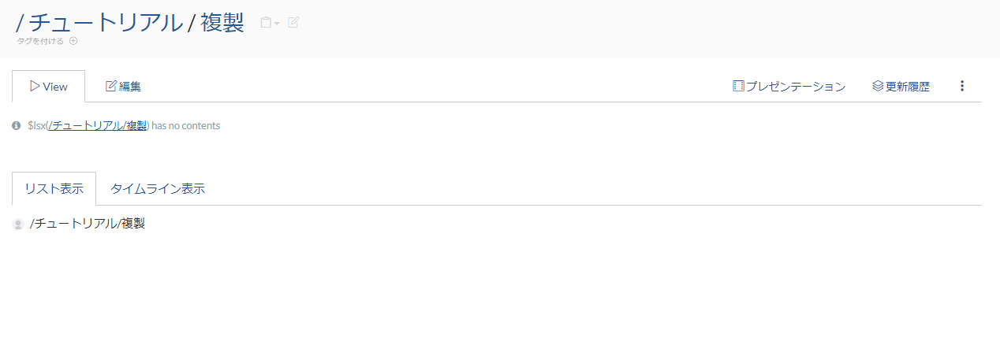
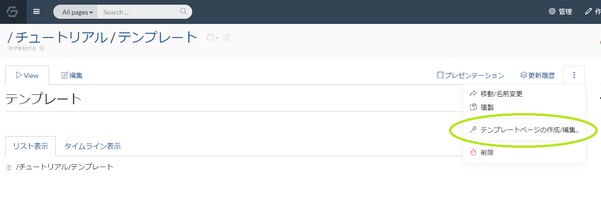
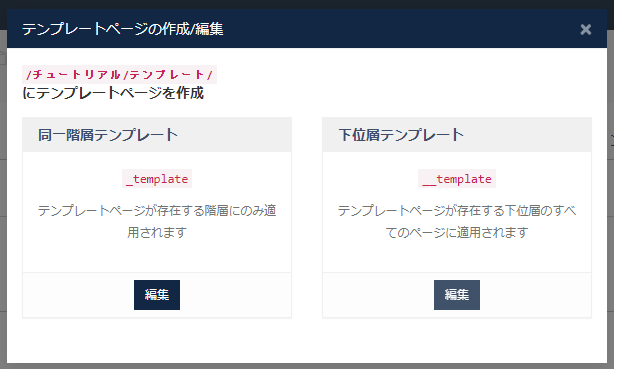
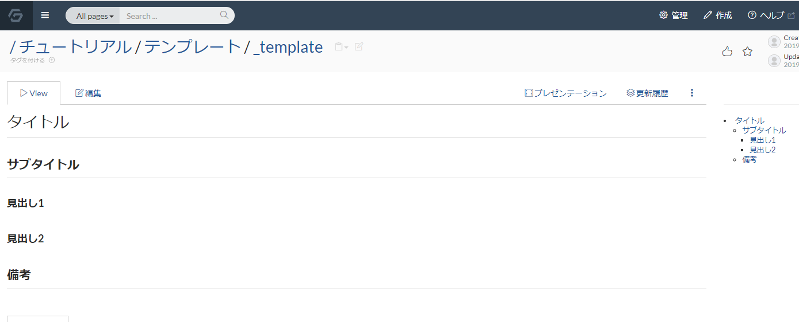

# ページを複製する

ページ作成が出来るようになったら、ページの複製の使い方を覚えましょう。

繰り返し利用するページがある場合、複製やテンプレートの仕組みを把握しているととても便利に活用出来ます。

## ページ作成チュートリアル後

まず、ページ複製をするために、階層作成のためのページを作成します。

チュートリアルのページなど、目安となるページで「作成」ボタンを押して、

複製ページを作成しましょう。




## ページを複製する

複製ページ配下に、複製元となる「20191101」のページを作成します。

ページ作成し、以下の markdown 記述を貼り付けて、ページを作成してください。

```
$lsx()
```

その後、作成した「20191101」のページの画面で、画像のメニューにある「複製」をクリックして下さい。


ページ名を「20191102」と入力して、「Duplicate page」ボタンを押しましょう。


画像のように、ページが複製されます。


このように、ページを複製することで、記述内容をコピーした wiki ページを簡単に作成する事が出来ます。

続いて、似た機能としてテンプレートの機能を利用してみましょう。


## テンプレートを作成する

テンプレートは、ページを新規作成するときに、固定した記述内容を割り当てる事が出来る機能です。

テンプレートには、同一階層テンプレートと階層テンプレートがあります。

同一階層テンプレートを作成すると、テンプレートページが存在する階層にのみ適用されます。

下位層テンプレートを作成すると、テンプレートページが存在する下位層のすべてのページに適用されます

ここでは同一階層テンプレートを利用します。



画像のように、テンプレートを作成のボタンをクリックすると、テンプレート選択欄になります。

同一階層テンプレートの編集ボタンをクリックします。すると、「_template」というページ名のページ作成画面になります。



この画面で、以下の markdown 記述を貼り付けて、ページを保存しましょう。


```
# タイトル

## サブタイトル

### 見出し1


### 見出し2


## 備考
```



これでテンプレート作成は完了です。

続いて、作成したテンプレートを実際に活用する方法を紹介します。

## テンプレートがあるページ配下にページを作成する

テンプレート作成をしたページにて、「作成」をクリックしてページを作成します。


すると、ページ作成直後に既にテンプレートで設定した内容が反映されています。


繰り返しページ作成する時にとても便利に活用できます。

是非積極的にテンプレート化する運用を考えて、効率的に wiki を構築しましょう。
