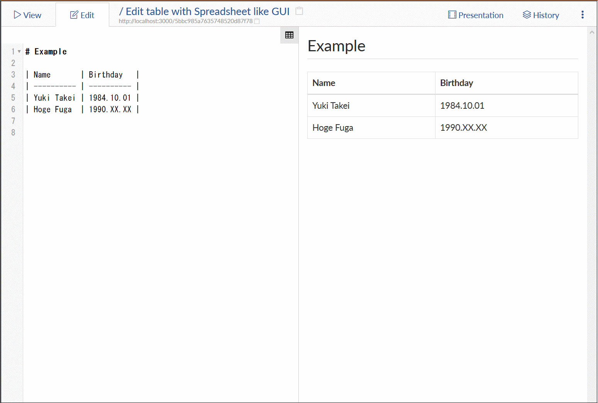
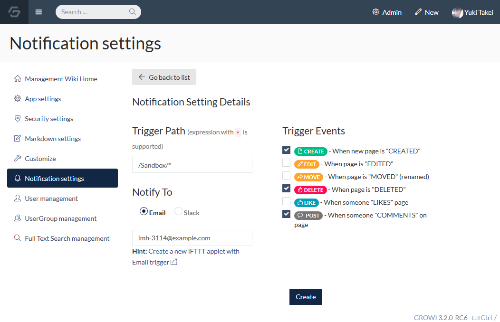

# What's New?

## v3.2.6

* 安定版

### 関連リンク

* [CHANGE LOG \(v3.2.6\)](https://github.com/weseek/growi/releases/tag/v3.2.6)
* [CHANGE LOG \(v3.2.5\)](https://github.com/weseek/growi/releases/tag/v3.2.5)

## v3.2.4

* Excel/Spreadsheet ライクな GUI によるテーブル\(表\)編集が可能に
* SAML \(SSO\) に対応
* その他バグフィックス

### 関連リンク

* [CHANGE LOG](https://github.com/weseek/growi/releases/tag/v3.2.4)
* [\[WESEEK Blog\] SAMLでのSSOが可能になり、ExcelライクなGUIテーブル編集機能を搭載](https://weseek.co.jp/article/2018/10/10/growi-3.2.4-handsontable/)

## v3.2.0

* HackMD 連携による同時多人数編集が可能に
* Twitter OAuth でのログイン
* その他バグフィックス

### 関連リンク

* [CHANGE LOG](https://github.com/weseek/growi/blob/master/CHANGES.md#320)
* [\[WESEEK Blog\] GROWI v2.3.0 リリース！HackMD との連携が可能に](https://weseek.co.jp/article/2018/08/07/growi-hackmd-integration/)

## v3.1.14

* 安定版

### 関連リンク

* [CHANGE LOG](https://github.com/weseek/growi/blob/master/CHANGES.md#3114)

## v3.1.13

* グローバル通知\(IFTTTとの連携\)
* LDAP ログイン時のメールアドレスのマッピング

### 関連リンク

* [CHANGE LOG](https://github.com/weseek/growi/blob/master/CHANGES.md#3113)

